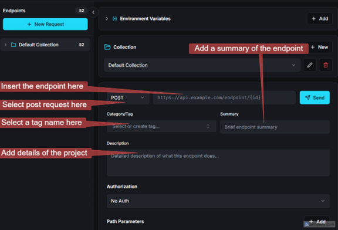
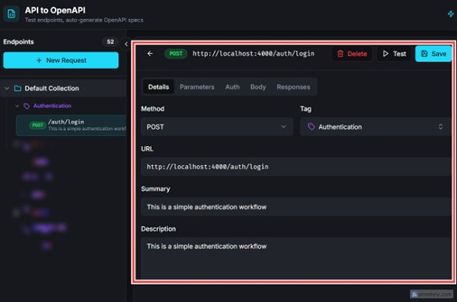
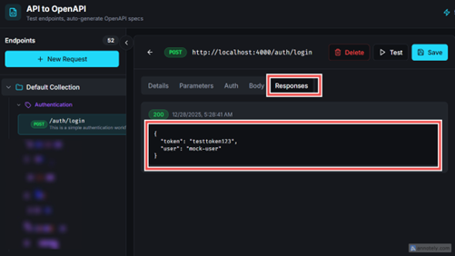
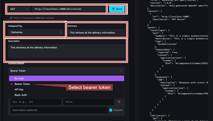
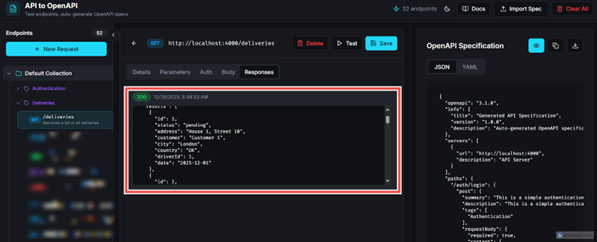
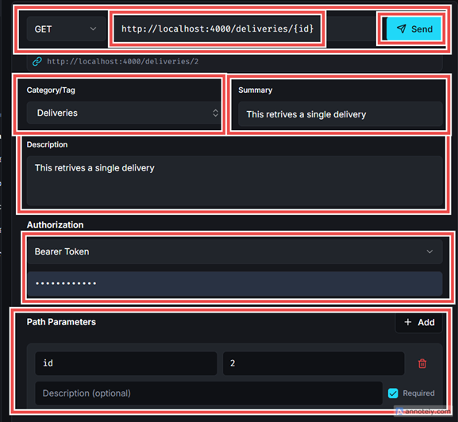
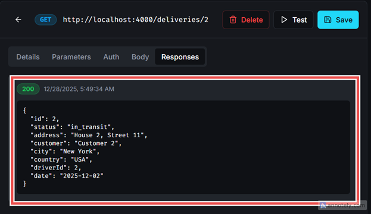
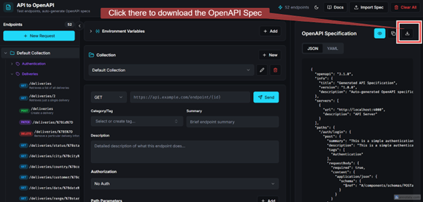
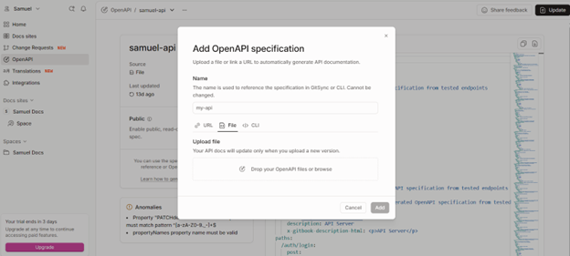
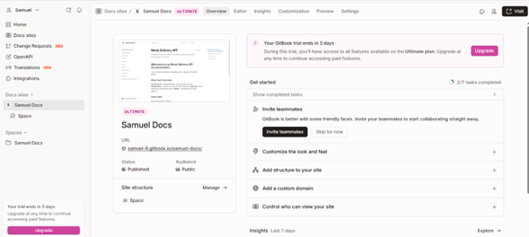

{/* truncate */}

---

# Introduction

````markdown
Well-structured API documentation is as important as the API itself. In this article, I walk through my full documentation process for the [Mock Delivery API](https://github.com/Technical-writing-mentorship-program/mock-delivery-api):

- Understanding the API behavior
- Documenting endpoints manually
- Converting requests into an OpenAPI 3.1 specification using an [API-to-OpenAPI-generator](https://openapi-spec-generator.netlify.app/)
- Publishing the documentation on GitBook for public consumption

This workflow mirrors what many real-world teams do when retrofitting documentation onto an existing API or mock service.

---

## Project Overview: Mock Delivery API

The Mock Delivery API is a simulated logistics and delivery service designed to represent common backend workflows in a delivery platform. It includes endpoints for:

- Authentication
- Drivers
- Parcels
- Deliveries
- Hubs
- Assignments
- Tracking
- Reports

[GitHub-Repository-link](https://github.com/Technical-writing-mentorship-program/mock-delivery-api)

---

## Prerequisites

Before starting, here are some basic things to know:

- Basic understanding of RESTful APIs[RESTful APIs](https://aws.amazon.com/what-is/restful-api)
- Familiarity with HTTP methods (GET, POST, PUT, DELETE)
- Knowledge of request–response cycles and status codes
- Understanding of authentication concepts (tokens, headers, authorization flow)
- Ability to read and interpret JSON payloads

---

## Understanding the API and Authentication Flow

Before writing any documentation, I reviewed the API behavior and request-response patterns, starting with authentication, since it governs access to protected endpoints.

The authentication flow follows a straightforward pattern:

1. A user submits login credentials to the authentication endpoint
2. The API returns an access token upon successful authentication
3. The token is included in subsequent requests as an authorization header

---

## Step 1 - Server Setup

Clone the repository on your local machine. Then open your terminal in VS Code and run:

```bash
npm install
npm start
```
````

Once the server starts, you will see:

```
http://localhost:4000
```

> **NOTE:** This URL is the base URL.

---

## Step 2 - Authentication

There are 52 endpoints to document, as listed in the README on [GitHub](https://github.com/Technical-writing-mentorship-program/mock-delivery-api?tab=readme-ov-file#authentication-flow/). Documentation starts with the Authentication section.

### Request

```
POST http://localhost:4000/auth/login
```

The above shows the authentication endpoint used to get the bearer token.

### Request Body

```json
{
  "username": "demo",
  "password": "demo"
}
```

### Response

```json
{
  "token": "testtoken123",
  "user": "mock-user"
}
```

This response returns the **Bearer token** used for authenticated requests.

---

The diagram below shows where to insert your endpoint, select your POST request, and insert the body while using your openapi-spec-generator. After filling in all the parameters, click send.



### Output

This output below shows a fully documented API endpoint, including:

- Method
- URL
- Tag
- Summary
- Description





After clicking **Send**, the `bearer token` appears in the response tab.

---

## Step 3 - Documenting Other Endpoints

This section demonstrates how to document additional endpoints using the Bearer token for authorization and how to use path parameters.

---

### Documenting the Deliveries Endpoint

1. GET /deliveries – list deliveries (supports status, city, country)
   This endpoint retrieves the entire list of deliveries

```
GET http://localhost:4000/deliveries
```

#### As shown in the image below, Steps:

- Select **GET** request
- Enter the endpoint
- Add a tag name
- Write a brief summary/description
- Add the **Bearer Token** in the Authorization section

  

### Output

This shows the output after clicking the send button; it provides a full list of all delivery records.



---

### 2. GET /deliveries/:id – Get Single Delivery

```
GET http://localhost:4000/deliveries/:id
```

This step demonstrates the use of a **path parameter** to retrieve information for a single delivery.

Use curly braces around id, as shown in the following URL, because the path parameter resolves to the value of the specific ID saved, returning only its details.

```
http://localhost:4000/deliveries/{id}
```

#### Steps:

- Select **GET** as the HTTP method, since this endpoint is used to retrieve data.
- Enter the endpoint URL in the request field provided.
- Next, assign a tag to categorize the endpoint (in this case, Deliveries), and add a concise summary/description that clearly explains the purpose of the endpoint.
- Write a clear description
- Under the Authorization section, select Bearer Token and enter provide a valid access token to authenticate the request
- To retrieve the delivery record with an ID of 2, navigate to the **Path Parameters** section. Path parameters use a key-value pair structure: enter id as the key and 2 as the corresponding value, then click send. This value is then substituted into the endpoint path, allowing the request to fetch the specific delivery resource, as illustrated in the image below.:
  - Key: `id`
  - Value: `2`

- Click **Send** to retrieve the specific record.

  

### Output

The image below shows the response after the request was sent. It retrieves only the delivery record with an ID of 2.



---

After documenting all endpoints, download the OpenAPI specification file.

---



## Step 4 - Publishing on GitBook

Go to [GitBook](https://www.gitbook.com/) and navigate to the OpenAPI tab at the left side section, as shown in the following image.

1. Navigate to the **OpenAPI** tab
2. Upload your OpenAPI specification file
3. After adding your OpenAPI specification, click **Publish**



This allows you to:

- Manage and publish API documentation
- Track progress
- Customize your documentation site
- Collaborate with your team

 [Published API Docs URL](https://samuel-8.gitbook.io/samuel-docs/)



---

## Next Steps

Explore the [OpenAPI Spec Generator](https://openapi-spec-generator.netlify.app/) to better understand how it helps you create structured API specifications quickly.

Use the [tool](https://openapi-spec-generator.netlify.app/) to:

- Generate specs
- Improve documentation workflows
- Access supporting resources
