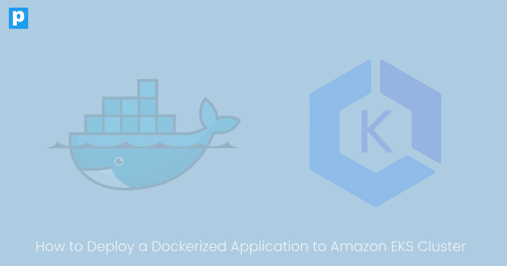
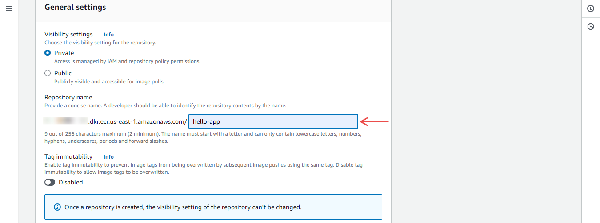
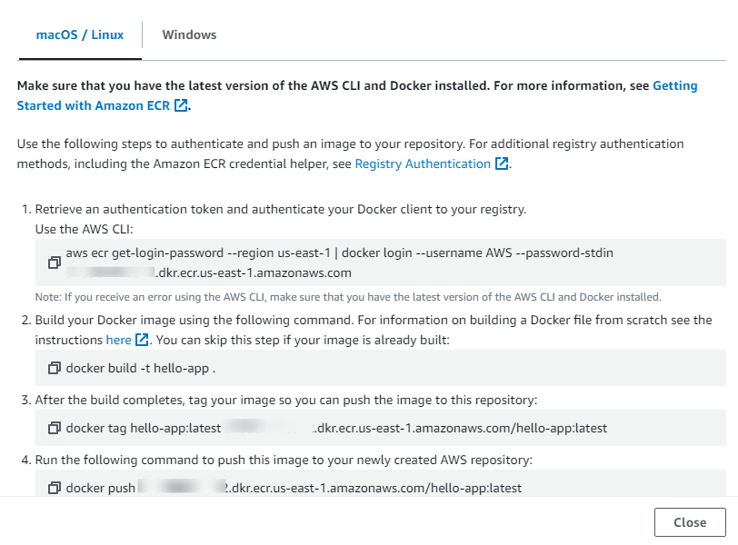
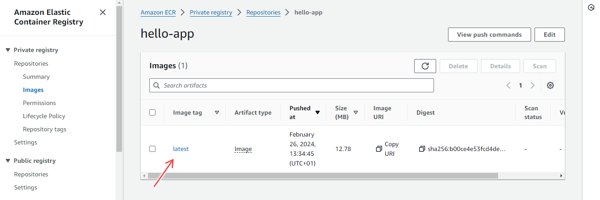
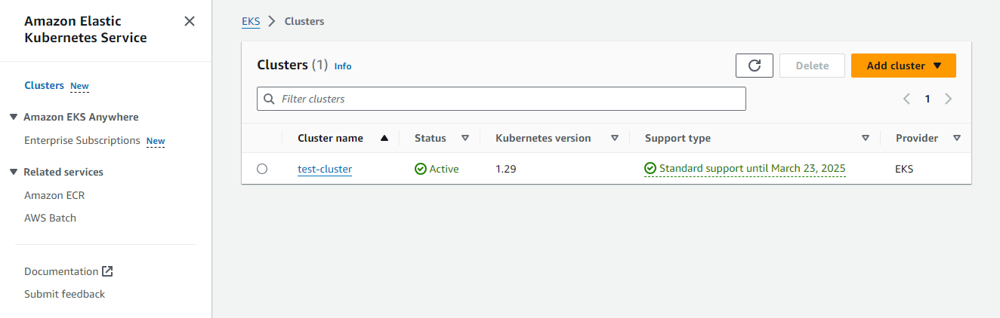
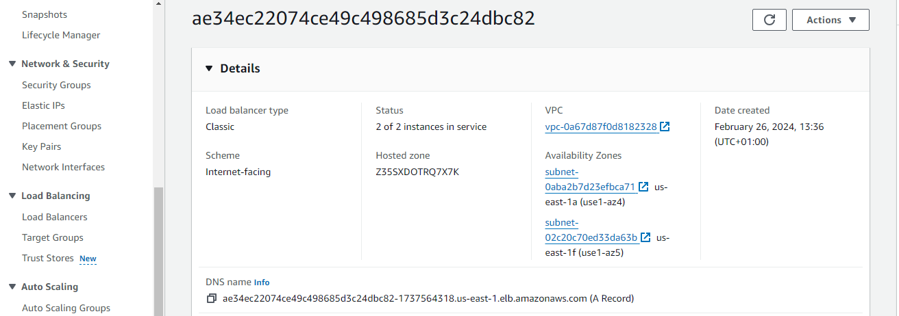
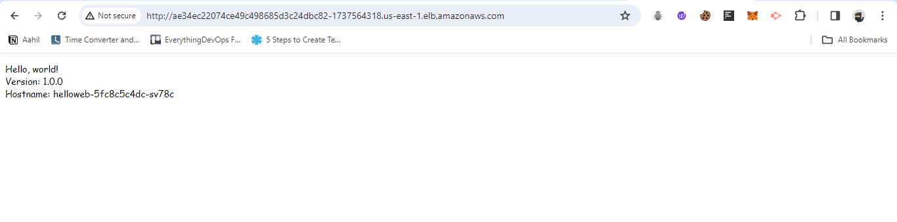

{/* truncate */}

## Introduction

Containers are a way to package, deploy, and manage applications. [Docker](https://docs.docker.com/get-started/overview/) is a popular open source containerization platform that allows you to package your application, its operating system (OS) libraries, and dependencies together into a container image. This container image can run on any system regardless of the underlying OS.

Usually, companies could have very few containers, which can be easily managed. However, with companies rapidly adopting containers, several containers can be managed. This is where container orchestration platforms come in. [Kubernetes](https://kubernetes.io/docs/concepts/overview/) is an open-source container orchestration platform that automates containerized applications' deployment, scaling, and management.

When setting up a Kubernetes cluster, you have to create and manage the Kubernetes control plane and the worker nodes. These individual tasks can become complicated because of the complexity of the Kubernetes architecture.

For this reason, most companies rely on managed Kubernetes services that abstract the complexity of managing the Kubernetes control plane while still providing the flexibility to manage the worker nodes. AWS provides a managed Kubernetes service called Elastic Kubernetes Service (EKS), and you'll learn how to deploy your containerized application to it in this tutorial.

In this article, you'll understand why major companies adopt managed Kubernetes services, especially Amazon EKS.

## Why EKS?

[Amazon EKS](https://aws.amazon.com/pm/eks/?gclid=CjwKCAiArfauBhApEiwAeoB7qMdCQdwq0XYNFlGNq1ULapznpksvaaTH6vH5T6fWylGsKSE46UBWWxoCToIQAvD_BwE&trk=c69c708c-c423-4c07-9fc8-513781540cc7&sc_channel=ps&ef_id=CjwKCAiArfauBhApEiwAeoB7qMdCQdwq0XYNFlGNq1ULapznpksvaaTH6vH5T6fWylGsKSE46UBWWxoCToIQAvD_BwE:G:s&s_kwcid=AL!4422!3!669047416746!e!!g!!aws%20eks!20433874212!155230227787) is a managed Kubernetes service that allows you to run Kubernetes on AWS without installing, operating, and maintaining your own Kubernetes control plane. It is fully compatible with the Kubernetes API, and you can use it to run your applications in a highly available manner across multiple availability zones.

With EKS, you only have to create and manage the worker nodes. AWS manages the control plane. This means you can focus on building and running applications without worrying about the complexity of managing the Kubernetes control plane.

EKS automatically upgrades the Kubernetes control plane and applies patches to the underlying nodes. This ensures your cluster is always updated with the latest security patches and features.

Since EKS is part of the AWS ecosystem, you can use other AWS services like IAM, VPC, and CloudWatch to manage and monitor your EKS cluster. This makes it easy to integrate your EKS cluster with other AWS services.

## Project Setup

There are several ways to create an EKS cluster, such as through the AWS EKS console, AWS CLI, or Terraform. However, in this tutorial, you’ll learn how to use the eksctl command-line tool to create an EKS cluster.

- The application will be containerized using Docker, and the container image will be pushed to the [Amazon Elastic Container Registry (ECR)](https://docs.aws.amazon.com/AmazonECR/latest/userguide/what-is-ecr.html).

- The EKS cluster will then be created using eksctl, and the application will be deployed from the container image in ECR.

- The deployment will be done using the Kubernetes CLI, Kubectl and the application will be exposed to the internet using an AWS Load Balancer.

## What is eksctl?

[eksctl](https://eksctl.io/) is a simple command-line utility created by Weaveworks that makes it easy to create, manage, and operate Kubernetes clusters on Amazon EKS. It automates the creation of an EKS cluster and the worker nodes via the CLI.

It is the official CLI tool for Amazon EKS and is written in Go. It is open-source and is actively maintained by the community.

## Prerequisites

This tutorial will be done on the AWS cloud platform. You'll need an AWS account to follow along. If you don't have an AWS account, you can create one [here](https://portal.aws.amazon.com/billing/signup?refid=em_127222&p=free&c=hp&z=1&redirect_url=https%3A%2F%2Faws.amazon.com%2Fregistration-confirmation#/start/email). You'll also need the following:

- AWS CLI installed and configured with your AWS account credentials. Install the AWS CLI by following the instructions [here](https://docs.aws.amazon.com/cli/latest/userguide/getting-started-install.html).
- Kubectl. Install kubectl by following the instructions [here](https://kubernetes.io/docs/tasks/tools/#kubectl).
- Docker. Install Docker by following the instructions [here](https://docs.docker.com/engine/install/).

## Application Setup

The application you’ll be deploying is a sample hello-world application provided by Google Cloud Platform. It is a simple web application that listens on port 8080 and returns a “Hello, World” message.

The application is written in Go and the source code is available on GitHub. Clone the repository by running the following command:

```bash
git clone https://github.com/GoogleCloudPlatform/kubernetes-engine-samples.git
```

Change into the directory of the application:

```bash
cd kubernetes-engine-samples/quickstarts/hello-app
```

### Step 1 - Containerize the Application

You need a Dockerfile to containerize the application, however, the application already has a Dockerfile. View the content of the directory to confirm the presence of the Dockerfile.

The following steps will guide you in building the Docker image and pushing it to Amazon ECR.

- **Build the Docker image**:

  ```bash
  docker build -t hello-app
  ```

- **Create an ECR repository**. Go to the AWS console and search for ECR. Click on **Get Started**. Give the repository a name and leave the other settings as default. Once you’re done, click on **Create repository**.

  

  _**Figure 1**. Create ECR Repository_

- **Authenticate Docker to the ECR registry**:

  ```bash
    aws ecr get-login-password --region <region> | docker login --username AWS --password-stdin <account-id>.dkr.ecr.<region>.amazonaws.com
  ```

  :::tip
  Replace `<region>` with your AWS region and `<account-id>` with your AWS account ID. You can get the exact push commands for your ECR repository by clicking on the **View push commands** button on the ECR console.
  :::


 
  _**Figure 2**. View Push Commands (ECR Repository)_

- **Tag the Docker image**:

  ```bash
    docker tag hello-app:latest <account-id>.dkr.ecr.<region>.amazonaws.com/hello-app:latest
  ```

  :::tip
  Replace `<account-id>` with your AWS account ID and `<region>` with your AWS region.
  :::

- **Push the Docker image to ECR**:

  ```bash
    docker push <account-id>.dkr.ecr.<region>.amazonaws.com/hello-app:latest
  ```

  :::tip
  Replace `<account-id>` with your AWS account ID and `<region>` with your AWS region.
  :::

  View the pushed Docker image on the ECR console.

  
 _**Figure 3**. ECR Repository Image_

### Step 2 - Install eksctl

You'll need to install `eksctl` if you haven't already. This tutorial uses a Linux machine. If that's not the case, you can find the installation instructions for your OS [here](https://docs.aws.amazon.com/emr/latest/EMR-on-EKS-DevelopmentGuide/setting-up-eksctl.html).

- **Download and install `eksctl`**:

  ```bash
    curl --silent --location "https://github.com/weaveworks/eksctl/releases/latest/download/eksctl_$(uname -s)_amd64.tar.gz" | tar xz -C /tmp
  ```

- **Move the extracted binary to `/usr/local/bin`**:

  ```bash
    sudo mv /tmp/eksctl /usr/local/bin
  ```

- **Test the installation**:

  ```bash
    eksctl version
  ```

  You should see the version of `eksctl` installed.


### Step 3 - Create an EKS Cluster

You'll use `eksctl` to create an EKS cluster. The following command will create an EKS cluster with two worker nodes of type `t3.medium` in the `us-east-1` region.

```bash
  eksctl create cluster --name test-cluster --version 1.29 --region us-east-1 --nodegroup-name linux-nodes --node-type t3.medium --nodes 2
```

The `--version` flag specifies the Kubernetes version to use. The `--nodegroup-name` flag specifies the name of the node group and the `--nodes` flag specifies the number of nodes to create.

Modify the flags to suit your needs. The command will take a few minutes to complete and you'll see the progress in the terminal. After completing the command, you can view the created EKS cluster on the AWS console.



 _**Figure 4**. EKS Cluster on AWS Console_


### Step 4 - Deploy the Application

Using `eksctl`, your EKS cluster information gets automatically added to the `kubeconfig` file. This means you can use kubectl to interact with the EKS cluster.

To verify, run the following command:

```bash
  kubectl get nodes
```

This should display the two worker nodes you created.

Deploy the application using the `helloweb-deployment.yaml` file. This file contains the deployment configuration for the application.

Navigate to the `kubernetes-engine-samples/quickstarts/hello-app/manifests` directory and view the content of the `helloweb-deployment.yaml` file.

The deployment configuration specifies the container image, the number of replicas, and the port to expose. However, you need to modify the `helloweb-deployment.yaml` file to use the container image you pushed to ECR.

:::tip
Replace the `image` field with the URL of the container image in ECR. The URL should be in the format `<account-id>.dkr.ecr.<region>.amazonaws.com/hello-app:latest`.
:::

After modifying the file, apply the deployment configuration:

```bash
  kubectl apply -f helloweb-deployment.yaml
```

This will create a deployment for the application. You can view the created deployment by running the following command:

```bash
  kubectl get deployments
```


### Step 5 - Deploy the Service

The application is deployed but it's not accessible from the internet. You'll create a service to expose the application to the internet. The service configuration is in the `helloweb-service-load-balancer.yaml` file. In the same directory, view the content of this file.

The service configuration specifies the type of service to create, the port to expose, and the target port. The service type is `LoadBalancer` which means an AWS Load Balancer will be created to expose the application to the internet.

Apply the service configuration:

```bash
  kubectl apply -f helloweb-service-load-balancer.yaml
```

This will create a service for the application. View the created service by running the following command:

```bash
  kubectl get services
```

The service will take a few minutes to be created after which you can view the Load Balancer on the AWS console.



 _**Figure 5**. Load Balancer on AWS Console_


### Step 6 - Access the Application

After the service is created, you can access the application online. Run the following command to get the URL of the Load Balancer:

```bash
  kubectl get svc
```

Access the application by visiting the URL in your browser.



_**Figure 6**. Hello World Application running on Browser_


## Clean Up

After you're done with the application, `eksctl` makes it easy to delete the EKS cluster and the worker nodes automatically. You can also delete the ECR repository to avoid incurring unnecessary costs.

- **Delete the EKS cluster**:

  ```bash
    eksctl delete cluster --name test-cluster
  ```

- **Delete the ECR repository**: Navigate to the ECR console and delete the repository.

## Common Issues

You might encounter a few issues when deploying an application to Amazon EKS. The following are some of the common issues and how to fix them:

- **Version incompactability**. This error is encountered when connecting to the EKS cluster using kubectl. The error message looks like this:

  ```bash
    Unable to connect to the server: getting credentials: decoding stdout: no kind "ExecCredential" is registered for version "client.authentication.k8s.io/v1alpha1" in scheme "pkg/client/auth/exec/exec.go:62"
  ```

  The key thing to note in this error message is the version `v1alpha1`. This means the `kubectl` version is not compatible with the EKS cluster version

  To fix this, upgrade the AWS CLI package installed on your machine. You can do this by running the following commands:

  ```bash
    curl "https://awscli.amazonaws.com/awscli-exe-linux-x86_64.zip" -o "awscliv2.zip"
    unzip awscliv2.zip
  ```

- **Access Denied**. This error occurs when you try to create an EKS cluster using `eksctl` and you don't have the necessary permissions or the AWS CLI is not properly configured. The error message looks like this:

  ```bash
    Error: checking AWS STS access – cannot get role ARN for current session: operation error STS: GetCallerIdentity, get identity: get credentials: failed to refresh cached credentials, no EC2 IMDS role found, operation error ec2imds: GetMetadata, http response error StatusCode: 404, request to EC2 IMDS failed
  ```

  To fix this, ensure you have the necessary permissions to create an EKS cluster and that the AWS CLI is properly configured.

  You can also check the AWS CLI configuration by running the following command:

  ```bash
    aws configure list
  ```

  This will display the AWS CLI configuration. Ensure that the `aws_access_key_id` and `aws_secret_access_key` are properly configured.

## Conclusion

In this tutorial, you learned how to deploy a containerized application to an Amazon EKS cluster. You containerized the application using Docker, pushed the container image to Amazon ECR, and created an EKS cluster using `eksctl`. You then deployed the application to the EKS cluster and exposed it to the internet using an AWS Load Balancer.

As much as this looks like an easy process, it is still quite manual and not feasible for large-scale applications or companies. For a better approach, DevOps teams rely on automating the process using IaC and CI/CD tools. This ensures that the deployment process is repeatable, consistent, and reliable.
