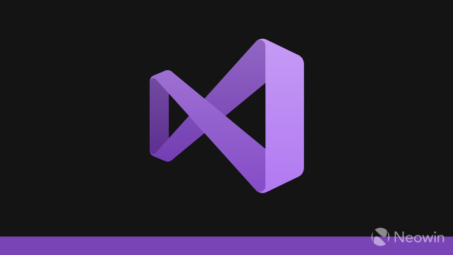
**Photo Credit:** [Neowin](https://www.neowin.net/news/microsoft-releases-developer-news-extension-for-visual-studio-after-complaints-from-users/)

{/* truncate */}

Are you enthusiastic about exploring the Visual Studio code editor as a noob? If yes, this article is for you.
Visual Studio(VS) code is a lightweight code editor developed by Microsoft. It supports Windows, Linux, and MacOS operating systems.
Visual Studio code can also be used as a text editor. It is written in typescript and Javascript.

This Integrated Development Environment (IDE) is developer-friendly and easy to use. This article will guide you through the:

- The system requirement for installing VS code
- The installation process
- Features of Visual Studio Code
- Navigating through Visual Studio code

## System Requirement
To install the VS code editor you must have the following system requirement

1. 1.6 GHz or a faster processor.

2. Above 1GB RAM space.

3. Windows, Linux, or MacOS operating system.

4. Stable internet connection for the installation process.

## Getting Started
Follow these steps for easy installation of the VS code IDE

**Step 1**: Go to the [Visual Studio code website](https://code.visualstudio.com/download)

**Step 2**: Click on your preferred operating system(OS) and download. In this guide, I will be using Windows OS.

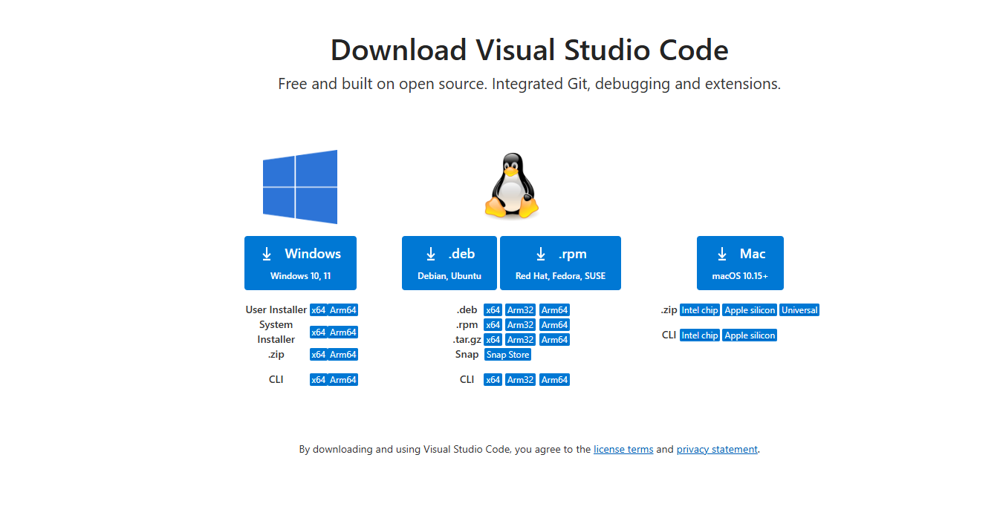
_**Fig.1**:Click preferred operating system_

**Step 3**: Locate the downloaded file in your folder

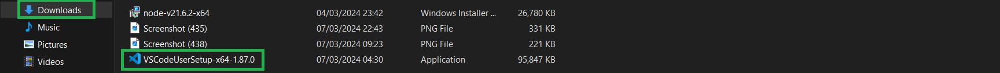
_**Fig.2**:Locate downloaded folder_ 

**Step 4**: Click on **open**

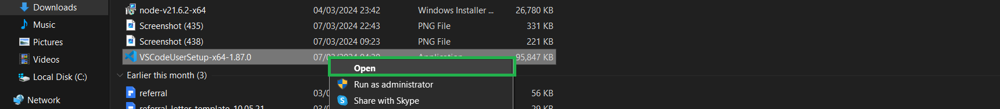
_**Fig.3**: Click open_

**Step 5**: Select the **I accept the agreement** and click on **Next**

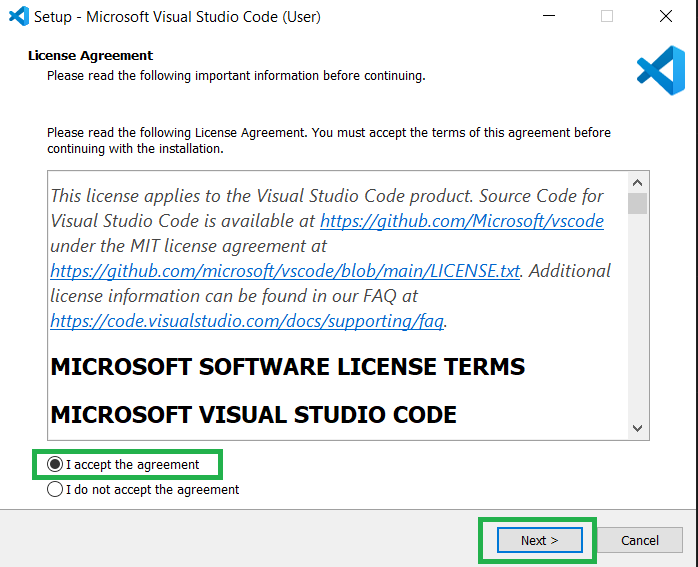
_**Fig.4**: Click next_

**Step 6**: Select the **Create Desktop Icon** and click on **Next**

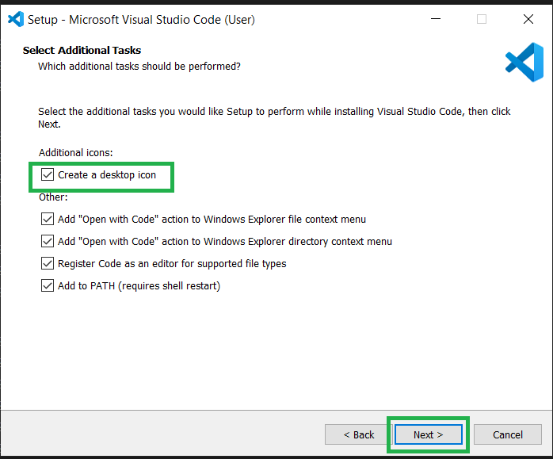
_**Fig.5**: select desktop icon and click the next button_

**Step 7**: Click on **Install**

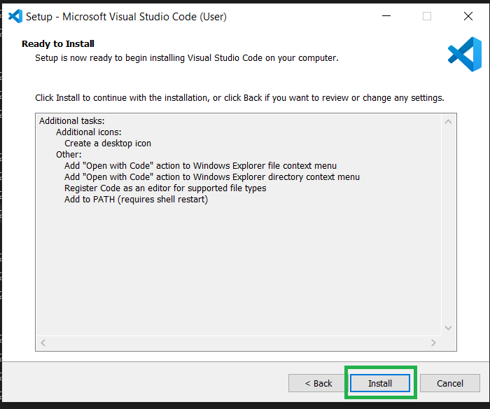
_**Fig.6**: Click install_

**Step 8**: Allow to install

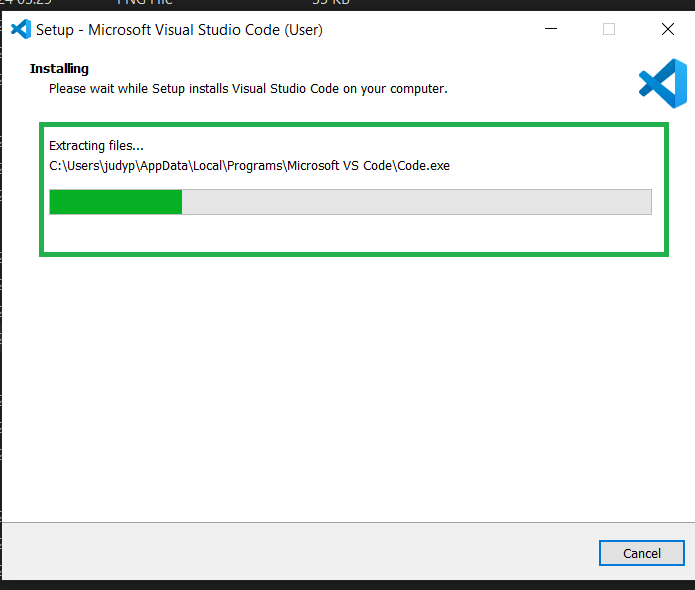
_**Fig.7**: Allow to install_

**Step 9**: Click on **Finish**

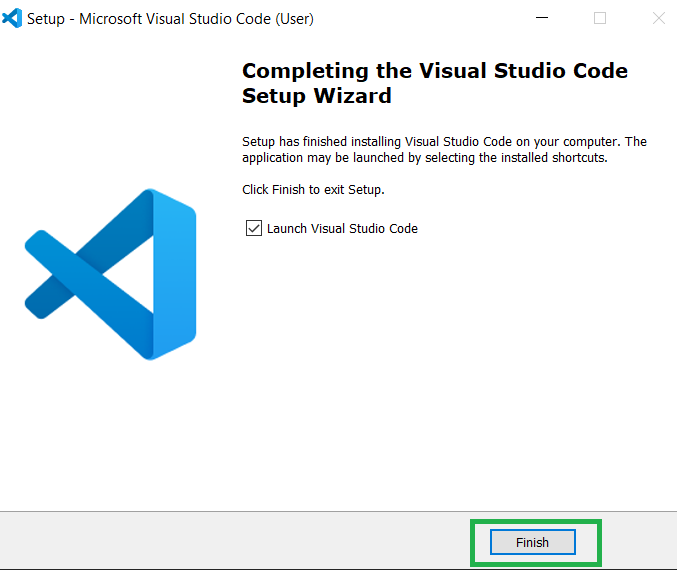

_**Fig.8**: Click finish_

**Step 10**: Visual Studio code will open with this interface  

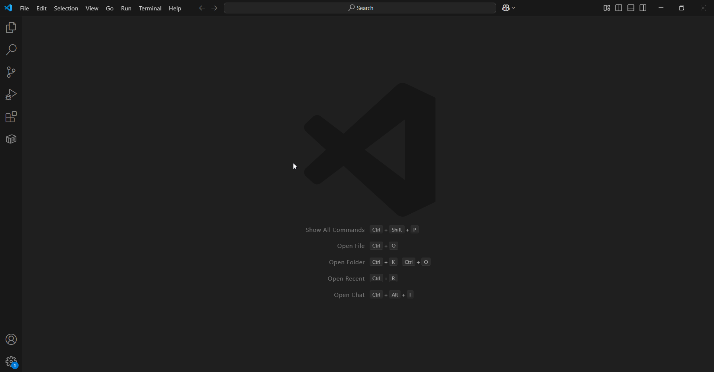
_**Fig.9**: VS code interface displays_

## Features of Visual Studio Code

VS code IDE has a lot of beautiful features that enhance developers experience. Some of the features are listed below:

**1. Debugging:** This feature allows you to debug your code using a breakpoint.

**2. Syntax highlighting:** This feature highlights your code when there is a syntax error.

**3. Code refactoring:** This feature allows you to restructure your code without altering the behavior or performance. 

**4. Embedded Git:** This embedded Git feature on VS code enables you to store your projects remotely.

**5. Code Completion:** This feature enhances the developer's speed and eases the stress of fully typing certain keywords or code. It auto-completes and also suggests code for you. 
:::tip Example
If you want to type a keyword   in a particular programming language, VS code automatically displays various keywords related to what you want to type for you to select.
:::
**6. Custom theme:** This feature allows you to customize the user interface of your VS code.

**7. Keyboard shortcuts:** VS code provides you with numerous keyboard shortcuts for navigating within the editor.

**8. Extensions and support for other programming languages:** This feature allows you to download and install various extensions into the IDE. It also supports various programming languages such as Java, Python, C++, Kotlin, etc.

## Navigating Through Visual Studio Code

Navigating through VS code doesn't require much experience as a beginner. This IDE is simple and easy to navigate. Upon launching your VS code a beautiful interface will be displayed on your screen.
I will explain each section of the User Interface (UI) using the label in the images below.

### **Activity Bar**

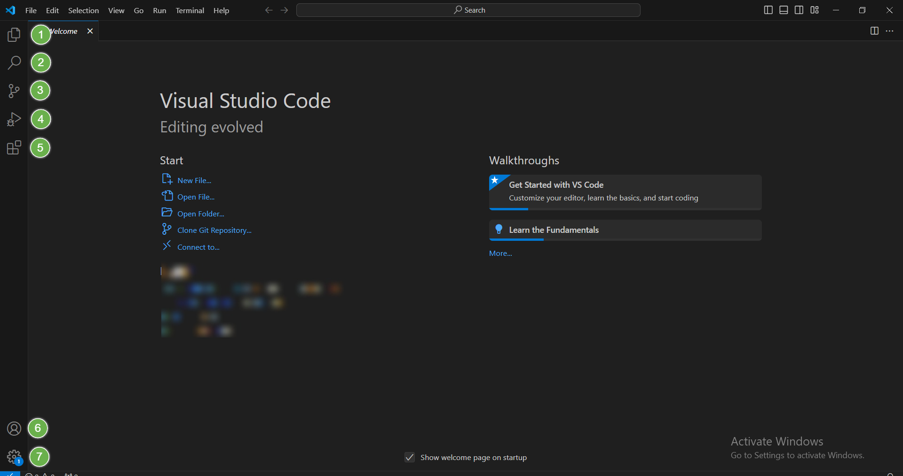
_**Fig.10**: Activity bar_

**1. Explorer:** This allows you to navigate between the files inside your folder.

**2. Search:** This allows you to search for files in the directory that open in VS code.

**3. Source Control:** This represents where you make your commits, push, pull, and other GitHub activities to and from your remote repository.

**4. Run and debug:** This allows you to run your code and debug.

**5. Extension:** This allows you to search for different extensions you want to download in the marketplace.

**6. Account:** This indicates your account on VS code.

**7. Settings:** This comes with different features that allow you to customize your VS code theme, check for updates, keyboard shortcuts, etc.

### **Welcome**

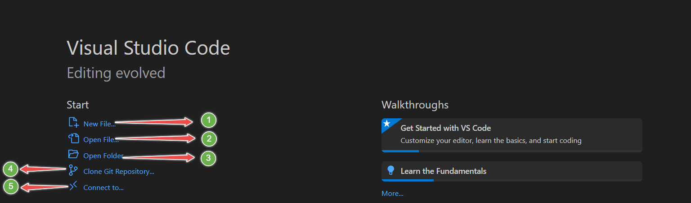
_**Fig.11**: Welcome image_

**1. New file:** Create a new file

**2. Open file:** Open previous files

**3. Open folder:** Open a folder from a different location on your PC.

**4. Clone git repository:** Allows you to clone a git repository

**5. Connect to:** Allows you to connect to a remote development workspace.

### **Menu Bar**

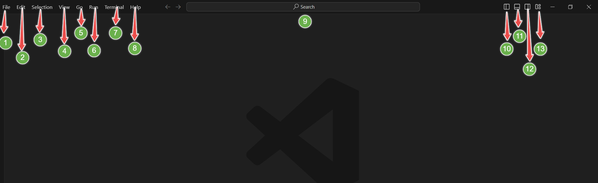
_**Fig.12**: Menu bar_

**1. File:** Create, save, open, files e.t.c

**2. Edit:** Edit the document or files you are working on.

**3. Selection:** This tab consists of keyboard options that allow you to make selections while working on your file.

**4. View:** Shows and allows you to switch between different views within VS code.

**5. Go:** Allows you to switch between editors.

**6. Run:** Allows you to run and debug your code.

**7. Terminal:** Allows you to run different git commands while working on your project.

**8. Help:** Provides different options on how to navigate through VS code. It also contains documentation, a playground, video tutorials, etc.

**9. Search Bar:** Search for files in the directory that is open in VS code

**10. Toggle Primary Sidebar:** Splits your screen into two parts in the left direction.

**11. Toggle Panel:** Opens the terminal where you can debug, run git commands, check for errors e.t.c

**12. Toggle Secondary sidebar:** Splits your screen into two parts in the right direction.

**13. Customize layout:** This allows you to customize your layout by setting the visibility. It also has some other cool features full screen mode, zen mode e.t.c

## Wrap Up

VS code is a code editor whose IDE is easy for beginners to adapt. In this guide, we discussed

- How to get started with VS code.
- Some basic features of VS code.
- How to navigate through VS code.

Hope you enjoyed my article.Connect with me on [Linkedln](https://www.linkedin.com/in/etugbo-judith-984545236) and [Twitter](https://x.com/judith_etugbo?t=eqQWuj8uDTQMtF5L1UPOVA&s=09)
