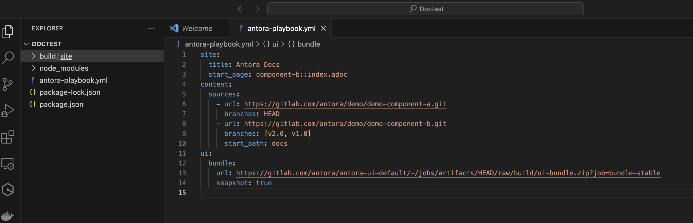
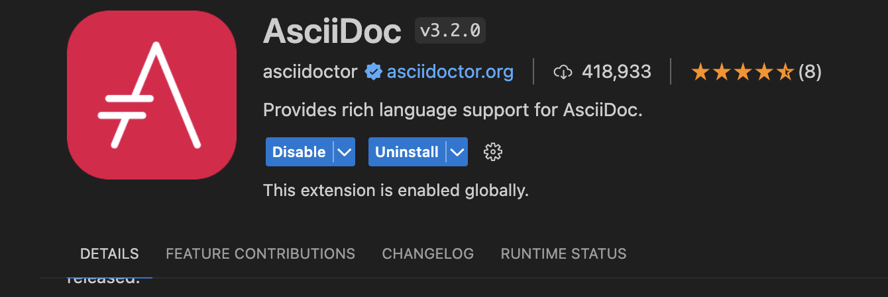
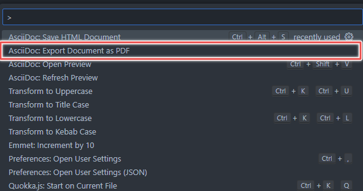
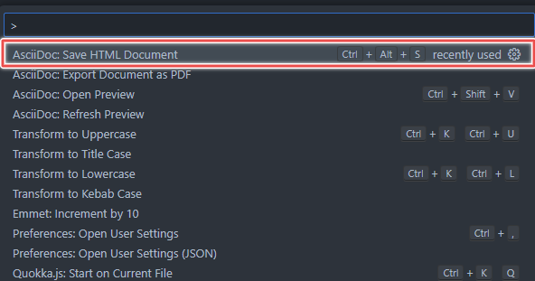
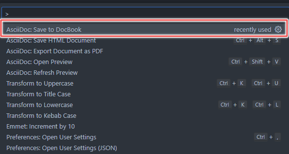

---

slug: Introduction to Antora for Beginners
title: Introduction to Antora for Beginners
description: This guide walks you through building a documentation site with Antora and AsciiDoc, including exporting to PDF, HTML, and other formats
authors: wisdom
date: 2024-02-29
tags: [antora, guide, docascode, documentation]
---


{/* truncate */}
Antora is a static site generator that transforms AsciiDoc content into documentation sites.

AsciiDoc is a lightweight markup language for creating notes, articles, books, and web pages. Its simplicity allows complex documents using plain text files.

This guide walks you through building a documentation site with Antora and AsciiDoc, including exporting to PDF, HTML, and other formats.

## 1. Install Antora

First, make sure you have [**Node.js**](https://nodejs.org/) installed on your system. Then, follow these steps:

a. Create a new directory for your documentation project.

b. Open a terminal and navigate to the project directory.

c. Run the following command to install Antora:

```
   node -e "fs.writeFileSync('package.json', '{}')" && npm i -D -E @antora/cli@3.1 @antora/site-generator@3.1
```

This command creates a `package.json` file and installs the Antora CLI and site generator as development dependencies in your project.

To verify that Antora is installed, run the following command:

```
    npx antora -v
```

If you encounter any issues during the installation, refer to the [official installation guide](https://docs.antora.org/antora/latest/install-and-run-quickstart/).

## 2. Set Up Your Documentation Content

a. Create an **Antora playbook file** (e.g., `antora-playbook.yml`) in your project directory. This file defines the structure of your documentation.

b. Specify the **content sources** (e.g., Git repositories, local directories) where your documentation files reside.

c. Define the **UI bundle** (e.g., a theme) that Antora will use to generate your site.

:::tip 
Playbook configuration

A playbook is a configuration file that tells Antora where to find the content and UI resources it needs to generate a documentation site.


:::

**To create a playbook, follow these steps:**

a. Using your preferred text editor or IDE, create a new file.

b. Populate the file with the configuration information provided below:

```{1-13} showLineNumbers
    site:
      title: Antora Docs
      start_page: component-b::index.adoc
    content:
      sources:
      - url: https://gitlab.com/antora/demo/demo-component-a.git
        branches: HEAD
      - url: https://gitlab.com/antora/demo/demo-component-b.git
        branches: [v2.0, v1.0]
        start_path: docs
    ui:
      bundle:
        url: https://gitlab.com/antora/antora-ui-default/-/jobs/artifacts/HEAD/raw/build/ui-bundle.zip?job=bundle-stable
        snapshot: true
```
_**This playbook file will create a site using the [Antora demo repositories](https://gitlab.com/antora/demo)**_

c. Save the file as `antora-playbook.yml` in the root folder.

- **Site**: Contains the documentation site’s title and start page.
- **Content**: Specifies content repository locations.
- **UI**: Defines the location of the UI bundle.
- **URL**: Content repository URL.
- **Branches**: Selected branches from the content repository.
- **Start Path**: Root path in the content repository.
- **Bundle**: UI bundle URL.
- **Snapshot**: Determines whether to use the UI bundle as a snapshot.

## 3. Generate Your Documentation Site

a. In the terminal, navigate to your project directory.

b. Run the following command to generate your site in the root folder:

```
    npx antora generate antora-playbook.yml
```

This command tells Antora to generate the documentation site in this folder `build/site` using your created playbook.


_**Figure 1**. An antora-playbook.yml file in VS Code._

:::tip 
Site generation complete!

:::


c. Open `file:///Users/wisdomnwokocha/Desktop/Doctest/build/site/index.html` in a browser to view your site.

d. Copy the URL and open the `index.html` file in your browser to see the result.


_**Figure 2**. Antora generated site welcome page_ 

To run Antora remotely, use the following command:

```
    npx antora -fetch antora-playbook.yml
```

:::tip 

Add this flag `--fetch` to fetch from a remote repo.


:::


Antora will clone the content and UI repositories and generate your documentation site to the default output directory.

Congratulations!

You’ve successfully built your first site with Antora.

### 3.1. AsciiDoc Basic Syntax

Now that you’ve created a documentation site, it’s time to learn how to create content using AsciiDoc.

To create content in **AsciiDoc**, you need to understand basic syntax.

Here’s a simple example:

```
    = Getting Started with Antora
    John Doe <john.doe@asciidoctor.org>

    == Section 1

    Lorem ipsum dolor sit amet, consectetur adipiscing elit. Sed sagittis metus at est scelerisque, nec faucibus neque dapibus. Duis vitae mi at eros tincidunt consequat.

    === Subsection 1.1

    Integer eget nibh nec nulla euismod finibus. Proin non ipsum vel leo rhoncus venenatis. Nam nec pharetra lorem.

    .Table Title
    |===
    |Name of Column 1 |Name of Column 2 |Name of Column 3

    |Cell in column 1, row 1
    |Cell in column 2, row 1
    |Cell in column 3, row 1

    |Cell in column 1, row 2
    |Cell in column 2, row 2
    |Cell in column 3, row 2
    |===
```
This example demonstrates the basic structure of an AsciiDoc document.

- The `=` character is used to define the document title.
- The `==` characters are used to define the section titles.
- The `===` characters are used to define the subsection titles.
- The `<>` character is used to define the author’s email address.

To learn more about the syntax, refer to the [AsciiDoctor Quick Syntax Reference](https://docs.asciidoctor.org/asciidoc/latest/syntax-quick-reference/).

## 4. Export as PDF, HTML, DocBook

You can export your AsciiDoc documents to PDF, HTML, and DocBook formats. An easy way to export your documents is to use the AsciiDoc extension for Visual Studio Code.

To use the AsciiDoc extension for Visual Studio Code, you need to install it from the [Visual Studio Code Marketplace](https://marketplace.visualstudio.com/items?itemName=asciidoctor.asciidoctor-vscode).

:::tip 
Make sure the extension you install is published by AsciiDoctor.
:::


The extension looks like this:


_**Figure 3.** AsciiDoc extension for VS Code_

After installation, ensure the extension is enabled in your Visual Studio Code settings.

a. **Export as PDF:** To export your AsciiDoc document as a PDF, follow these steps

i. Open the command palette using the following command:
   ctrl+shift+p // On Windows. Alternatively, use F1.
   cmd+shift+p // On Mac

ii. Select `AsciiDoc: Export document as PDF`.

   

   _**Figure 4.** How to export AsciiDoc document as PDF_

iii. The AsciiDoc extension will prompt you to select the PDF's desired file name and location.

 <script async src="https://pagead2.googlesyndication.com/pagead/js/adsbygoogle.js?client=ca-pub-5378239849378753"
       crossorigin="anonymous">
</script>

<ins class="adsbygoogle"
       style={{display:"block"}}
       data-ad-format="fluid"
       data-ad-layout-key="-69+df+2w-69+99"
       data-ad-client="ca-pub-5378239849378753"
       data-ad-slot="8738845156">
</ins>

  <script>
       (adsbygoogle = window.adsbygoogle || []).push({});
  </script>


b. **Save as HTML:** To generate HTML from your AsciiDoc file, follow the steps below:

i. Open the command palette.

ii. Select `AsciiDoc: Save HTML document`.
  

   _**Figure 5.** How to save AsciiDoc file as HTML document_

iii. The file is generated in the same folder as the source document.

To quickly do this, use the shortcut keys below:

```
     ctrl+alt+s \\ On Windows
     cmd+alt+s \\ On Mac
```

c. **Save to DocBook:** DocBook is another type of markup language used in technical documentation.

To save your AsciiDoc file to DocBook, follow the steps below:

i. From the command palette.

ii. Select `AsciiDoc: Save to DocBook`.

  

  _**Figure 6.** How to save document to DocBook_

iii. The file is generated in the same folder as the source document.

:::tip 
Only DocBook 5 is supported
:::


## 5. Customize Your Playbook and Publish Antora on GitHub

* Create a `/docs` in the root folder of your project.

* Copy the content from the [GitHub repository’s](https://github.com/wise4rmgod/antora) `docs` folder into your own.

* Modify the content as needed.

a. **Work Offline**

- Run the following command to generate your site using the modified playbook:

```
    npx antora antora-playbook.yml
```

b. **Update Your Playbook**

- Edit your playbook (`antora-playbook.yml`) with the following configurations:

  > Your URL is pointing to the root folder (.)

```
      site:
        title: Wizzy Docs
        start_page: component-b::index.adoc
      content:
        sources:
          - url: .
            start_path: docs
      ui:
        bundle:
          url: ./ui-bundle
      antora:
        extensions:
          - "@antora/lunr-extension"
```

- Push all changes to your GitHub repository.
- Configure GitHub Pages for your repo[Link to do this on Github].
- Use the following Git Action workflow to deploy your Antora page to GitHub Pages:

:::tip 
Ensure you have enabled your repository's GitHub Pages by creating a gh-pages branch.
:::
  
_**Simple workflow for deploying static content to GitHub Pages:**_
    

```
    name: Deploy Antora static content to Pages
    on:
      # Runs on pushes targeting the default branch
      push:
        branches: ["main"]
      # Allows you to run this workflow manually from the Actions tab
      workflow_dispatch:
    # Sets permissions of the GITHUB_TOKEN to allow deployment to GitHub Pages
    permissions:
      contents: write
      pages: write
      id-token: write
    # Allow only one concurrent deployment, skipping runs queued between the run in-progress and latest queued.
    # However, do NOT cancel in-progress runs as we want to allow these production deployments to complete.
    concurrency:
      group: "pages"
      cancel-in-progress: false
    jobs:
      deploy:
        environment:
          name: github-pages
          url: ${{ steps.deployment.outputs.page_url }}
        runs-on: ubuntu-latest
        steps:
          - name: Checkout
            uses: actions/checkout@v4
          - name: Setup Pages
            uses: actions/configure-pages@v4
          - name: Upload artifact
            uses: actions/upload-pages-artifact@v3
            with:
              # Upload entire repository
              path: "./build/site"
          - name: Deploy to GitHub Pages
            id: deployment
            uses: actions/deploy-pages@v4
            with:
              github_token: ${{ secrets.GITHUB_TOKEN }}
              publish_dir: ./build/site # Update this to match your Antora output directory
```

c. **To Publish Your Changes**

* **Make Edits**: Update your documentation files as needed.

* **Commit**: Commit your changes to Git.

* **Push to GitHub**: Always push your changes to GitHub.

* **Live Updates**: Your updated content will be live once it’s pushed to the repository.

## 6. Azure DevOps Pipeline for Publishing Antora Page to AzureStaticWeb

a. **Follow the Same Process as GitHub**

- Just like you did for GitHub, follow a similar process for AzureStaticWebApp.
- Make sure your documentation is ready and committed in your repository.

 <script async src="https://pagead2.googlesyndication.com/pagead/js/adsbygoogle.js?client=ca-pub-5378239849378753"
       crossorigin="anonymous">
    </script>

<ins class="adsbygoogle"
       style={{display:"block"}}
       data-ad-format="fluid"
       data-ad-layout-key="-69+df+2w-69+99"
       data-ad-client="ca-pub-5378239849378753"
       data-ad-slot="8738845156">
    </ins>

  <script>
       (adsbygoogle = window.adsbygoogle || []).push({});
  </script>


b. **Create an Azure Pages Workflow**

- Set up a workflow file (e.g., `azure-pages.yml`) in your repository.
- This workflow will deploy your Antora page to AzureStaticWebApp.

```
    name: Azure Static Web Apps CI/CD
    pr:
      branches:
        include:
          - main
    trigger:
      branches:
        include:
          - main
    jobs:
      - job: build_and_deploy_job
        displayName: Build and Deploy Job
        condition: or(eq(variables['Build.Reason'], 'Manual'),or(eq(variables['Build.Reason'], 'PullRequest'),eq(variables['Build.Reason'], 'IndividualCI')))
        pool:
          vmImage: ubuntu-latest
        steps:
          - checkout: self
            submodules: false
          - task: AzureStaticWebApp@0
            inputs:
              azure_static_web_apps_api_token: [TOKEN-HERE]
              ###### Repository/Build Configurations - These values can be configured to match your app requirements. ######
              # For more information regarding Static Web App workflow configurations, please visit: https://aka.ms/swaworkflowconfig
              app_location: "./" # App source code path
              app_build_command: "npx antora --fetch antora-playbook.yml"
              api_location: "" # Api source code path - optional
              output_location: "./build/site" # Built app content directory - optional
    ###### End of Repository/Build Configurations ######
```
