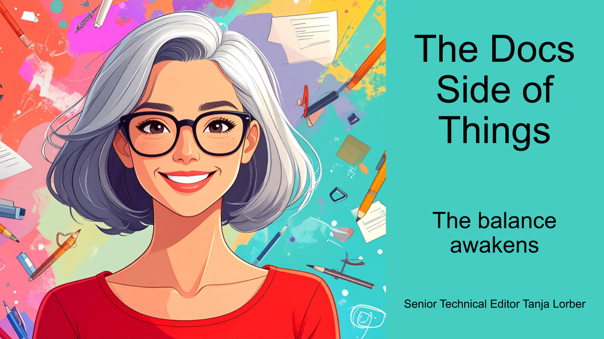

{/* truncate */}

Welcome to my article series on technical writing! After 30 years in the profession, I’ve seen the field evolve in many ways. Over that time, I’ve learned some lessons (and made plenty of mistakes) that shaped how I work.

---

In this series, I share practical strategies that I hope you’ll find helpful. Feel free to adapt them to your own writing process. 🙂

# When content feels off

One of the hardest skills to develop as a technical writer is editorial judgment: the ability to look at a piece of content and sense when something is off.

Learning to see balance is one way you can develop this judgment. Documentation follows patterns, and readers learn those patterns as they move through your content. A sense of balance helps you notice when content does not follow established patterns.

That does not automatically mean something is wrong. Some content needs a different pattern. But it is worth asking why.

So how do you awaken your sense of balance? Take a step back, look at your content from different perspectives, and ask how it fits together.

# Balance in elements

Look at the balance of elements inside a topic. Headings, text, images, tables, and admonitions all serve a specific purpose.

Imagine a topic with three admonitions, five screenshots, several tables, and two paragraphs of text.

Ask yourself: Am I using the elements for their intended purpose?

A screenshot helps readers visualize something. But if you use it to convey information that should be text, it may be the wrong choice. An admonition highlights important information. But if you stack several together, you water down the importance of each one.

The goal is not to use fewer elements on a page. It is to use each element for its intended purpose and where it adds value.

# Balance in length

Compare topics that sit next to each other in the content structure and ask whether the collection feels balanced.

Imagine a section containing three concept topics. Two of them are around 500 words long. One is 3,000 words long.

Ask yourself: Why is one topic much longer than the others? Should I split it into several smaller topics? Are the other topics missing information?

The goal is not to make every topic the same length. It is to make the difference intentional, rather than something that happened because one topic is simply the oldest and has grown over time.

# Balance in depth

Zoom out a bit more. Look at the topic in the context of the full content structure and compare it with topics that cover comparable information.

Imagine two concept topics. The first one explains only the concept. The second one also contains configuration information.

Ask yourself: Why does one topic cover more aspects of the subject than the comparable topic?

This can have several reasons:

- The first topic is missing information. If both topics should provide the same level of detail, add the missing configuration information to the first topic.
- The second topic belongs further down in the content structure, where topics provide more detailed information. In that case, move the topic to its appropriate place in the structure.
- The configuration information belongs somewhere else. Perhaps there is a central configuration topic that concept topics should link to. In that case, move the configuration from the second topic to the central topic.

There might be many more reasons. The important part is noticing the difference and making an intentional decision. If you decide to keep the content as it is, that is a valid outcome.

# Balance in language

Readers learn language patterns just as they learn content patterns.

Look at how you name and describe similar things. Do you follow the same patterns, or does every topic feel like it was written by a different author?

Imagine a section with the following tasks:
- Creating Users
- Set Up User Groups
- How permissions work

Individually, the titles are clear. Together, they follow different naming patterns.

The same applies to introductions. If one topic starts with a one-sentence summary while another begins with several paragraphs of background information, readers have to adjust their expectations every time they open a new topic.

Ask yourself: Am I using similar naming patterns for similar topics? Is the terminology I use consistent throughout my topics? Do my introductions give readers a similar idea of what they will find?

The goal is not to make every title or introduction identical. It is to make your language predictable so readers can focus on the content instead of interpreting your wording.

# Awaken your sense of balance

Editorial judgment is not something you develop by simply memorizing rules.

Style guides, templates, glossaries, and terminology checkers are valuable tools. They help you create consistency across your content, especially for things like heading styles, capitalization, terminology, and naming conventions.

Use these tools to guide you. Learn why these rules exist. Understand what reader problem they solve. Then apply the rules intentionally when you create and review content.

Readers learn patterns. Good technical writers learn to see them first.

---

Thanks for reading! I hope that with these methods, you'll grow more confident in trusting your editorial judgment.

# Further reading
For those interested in exploring further, I’ve compiled a list of related resources from the technical writing community, which I hope you’ll enjoy.

- [What makes docs beautiful?](https://passo.uno/what-makes-docs-beautiful/) by Fabrizio Ferri Benedetti
- [Lessons for technical writers from iPhone's dominance](https://damilola-oladele.dev/posts/lessons-for-technical-writers-from-iphone-dominance/) by Damilola Oladele
- [The Documentation Review Process: A 7-Step Guide by](https://instantdocs.com/blog/the-documentation-review-process) Bildad Oyugi

I’ll continue to share insights in this series, so stay tuned for the next installment. 🤓

