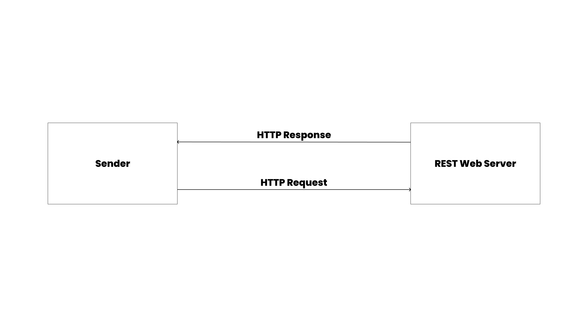
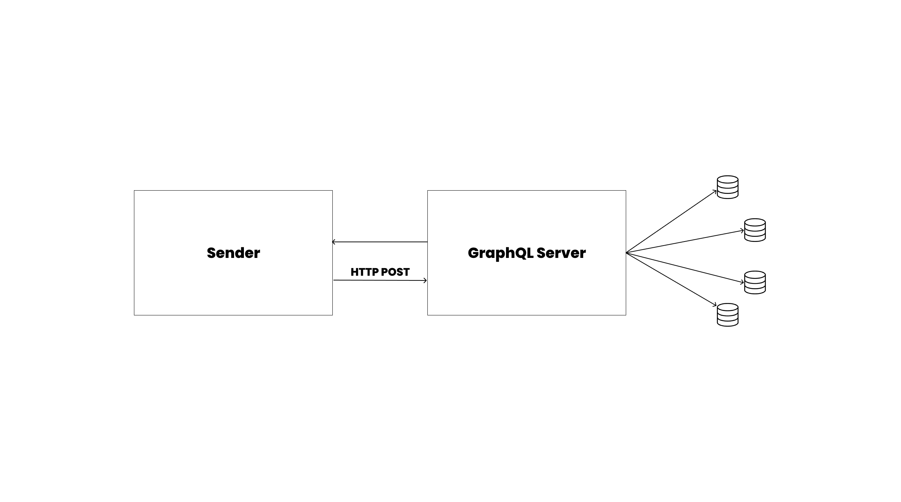
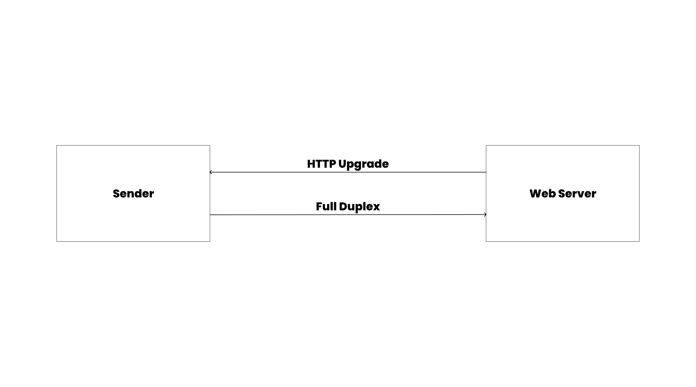

You can't fully understand the concept of APIs without understanding how they're designed. If you've been playing with APIs for a while now, you might have encountered terms like REST, SOAP, and GraphQL. These are exactly what we'll be looking at in this section.

## What are API Architecture Styles?

API architecture styles are frameworks that dictate how APIs are structured and communicate. These styles define the rules and conventions for requesting, transferring, and receiving data between systems.

Understanding API architecture styles is important because it helps you design and implement efficient and maintainable APIs. These styles impact how easily systems can integrate, how data is formatted, and the overall security of communication.

Examples of these API architectural styles include:

- Representational State Transfer (REST)
- Simple Object Access Protocol (SOAP)
- GraphQL
- gRPC
- Webhooks
- WebSockets, etc.

This course will focus on documenting RESTful APIs. However, we'll give an overview of some of these API architectural styles.

## SOAP

Simple Object Access Protocol (SOAP) is a mature and well-known API architectural style. It is used to exchange structured information for the implementation of web services. SOAP relies on XML (Extensible Markup Language) for its message format. This ensures that messages are platform-independent and can be read by any system that understands XML.

One of SOAP's key features is its support for complex operations and stateful interactions. This means that SOAP can handle more sophisticated interactions than simpler protocols, such as those requiring multiple steps or transactions. However, this complexity also makes SOAP more heavyweight, requiring more resources to parse and process the XML messages.

### How Does SOAP Work?

When you use SOAP, you typically send a request from a client to a server. This request is an XML document that contains a structured query or command.


_**Fig.1**: A diagram describing how SOAP works_

The server processes this request and responds with another XML document containing the requested data or the result of the command.

SOAP is designed to work over various network protocols, including HTTP, SMTP, and more, making it versatile for different types of network environments.

### Structure of SOAP

The technical aspects of SOAP include its reliance on a standard set of rules for formatting messages, which ensures that the communication is consistent and understandable by any system that adheres to these standards.

It uses a specific envelope structure for messages, which includes a header and a body. The header can contain metadata about the message, such as security credentials, while the body contains the actual data or commands being exchanged.

Below is an example of this structure. The following is a SOAP request to get information about a book by its ISBN.

```{1-11} showLineNumbers
<soapenv:Envelope xmlns:soapenv="http://schemas.xmlsoap.org/soap/envelope/" xmlns:lib="http://example.com/library">
    <soapenv:Header/>
    <soapenv:Body>
        <lib:GetBookDetailsResponse>
            <lib:Title>Example Book Title</lib:Title>
            <lib:Author>John Doe</lib:Author>
            <lib:Publisher>Example Publisher</lib:Publisher>
            <lib:Year>2009</lib:Year>
        </lib:GetBookDetailsResponse>
    </soapenv:Body>
</soapenv:Envelope>
```

The following is a breakdown of this SOAP request:

- `<soapenv:Envelope>`: This is the root element of a SOAP message, defining the XML namespace for the SOAP envelope.
- `<soapenv:Header>`: This optional element can contain metadata, such as authentication information. It's empty in this example.
- `<soapenv:Body>`: This element contains the actual message.
- `<lib:GetBookDetailsRequest>`: This is the specific request being made, defined within a namespace for the library service.
- `<lib:ISBN>`: This element contains the parameter for the request, which is the ISBN of the book.

In this example, the client sends a SOAP request with an ISBN number to the server. The server processes this request, retrieves the book details, and sends back a SOAP response with the book's title, author, publisher, and year of publication.

The SOAP architectural style is popularly used in enterprise environments such as financial services, payment gateways, and telecommunications.

## REST

Representational State Transfer (REST) is an architectural style for designing networked applications. It relies on a stateless, client-server, cacheable communication protocol, which in most cases is HTTP.

RESTful APIs use standard HTTP methods to perform operations on resources. These resources are identified by URLs, and the interactions with these resources are done through HTTP requests and responses, typically using JSON or XML for data exchange.

REST is designed to be simple and lightweight, making it easy to use and understand. It leverages the existing capabilities of the web and HTTP, allowing for scalability and flexibility. Unlike SOAP, REST does not have a strict standard, giving developers more freedom in how they design their APIs.

### How Does REST Work?

When you use REST, the client makes an HTTP request to a specific URL, which represents a resource.

An example of a resource in REST looks like this:

```bash
https://example.com/api/v3/users
```

From the URL above, the resource is identified by `users`. That means if you query this URL, you'll be accessing a collection of user-related data.


_**Fig.2**: A diagram describing how REST works_

The server processes the request and returns an appropriate HTTP response, typically with a status code and the requested data in a standard format like JSON.

RESTful APIs can perform various operations using different HTTP methods:

- `GET`: Retrieves a resource.
- `POST`: Creates a new resource.
- `PUT`: Updates an existing resource.
- `DELETE`: Removes a resource.

### Structure of REST

REST is stateless. This means each request from a client to the server must contain all the information needed to understand and process the request.

Using the same book example above, imagine the client making an HTTP GET request to the server. This is what the REST request would look like:

```{1-4} showLineNumbers
GET /books/978-3-16-148410-0 HTTP/1.1
Host: api.example.com
Accept: application/json
```

Below is a breakdown of this request:

- `GET`: The HTTP method used to request data from the server.
- `/books/978-3-16-148410-0`: The URL endpoint, with `978-3-16-148410-0` being the ISBN of the book.
- `Host: api.example.com`: The domain of the API server.
- `Accept: application/json`: Indicates that the client expects the response to be in JSON format.

The server will process this request and respond with the following JSON data:

```json {1-9} showLineNumbers
HTTP/1.1 200 OK
Content-Type: application/json

{
    "title": "Example Book Title",
    "author": "John Doe",
    "publisher": "Example Publisher",
    "year": 2023
}
```

With its stateless nature and reliance on web standards, REST is ideal for building scalable and performant web services.

## GraphQL

GraphQL is an open source architectural style and query language for APIs. It is a runtime for executing queries by using a type system you define for your data.

GraphQL was developed by Meta (Facebook) and provides a more flexible and efficient alternative to REST. It allows clients to request exactly the data they need and nothing more. This reduces the amount of data transferred over the network.

With GraphQL, clients can specify the structure of the response, making it possible to retrieve multiple resources in a single request. This reduces the need for multiple API calls and can significantly improve the performance of applications.

### How Does GraphQL Work?

In GraphQL, you interact with a single endpoint, typically `/graphql`. You send a query specifying the exact data you need, and the server responds with the data in the requested format.


_**Fig.3**: A diagram describing how GraphQL works_

GraphQL uses a schema to define the types of data and the relationships between them, ensuring that queries are valid and return predictable results.

### Structure of GraphQL

From our book example, imagine the client sends a query to the GraphQL endpoint instead:

```{1-7} showLineNumbers
query {
    book(isbn: "978-3-16-148410-0") {
        title
        author
        year
    }
}
```

Below is a breakdown of this query:

- `query`: Indicates that this is a read operation.
- `book(isbn: "978-3-16-148410-0")`: Specifies the `book` field and passes the ISBN as an argument to fetch the specific book.
- `{ title author year }`: Specifies the fields we want to retrieve for the book, which are `title`, `author`, and `year`.

The server will process this query and respond with the following JSON data:

```json {1-9} showLineNumbers
{
  "data": {
    "book": {
      "title": "Example Book Title",
      "author": "John Doe",
      "year": 2023
    }
  }
}
```

Below is an explanation of the response:

- `data`: The root field containing the data requested by the query.
- `book`: The field corresponding to the `book` query.
- `title`, `author`, `year`: The specific fields requested in the query, with their respective values.

### How GraphQL Differs from REST

GraphQL allows clients to request exactly the data they need, whereas REST typically returns a fixed structure of data. This can result in over-fetching or under-fetching data with REST.

Popular platforms like GitHub and Shopify, as well as most social media platforms and other content-heavy applications, rely on GraphQL.

## WebSockets

WebSockets are a communication protocol providing full-duplex communication channels over a single, long-lived connection between a client and server.

Unlike traditional HTTP, where a new connection is established for each request-response cycle, WebSockets allow for continuous, bidirectional communication. This makes WebSockets best suited for real-time applications where frequent updates are required.

WebSockets work by upgrading an HTTP connection to a WebSocket connection using a [handshake process](https://www.linkedin.com/pulse/websocket-handshaking-explained-understanding-key-real-time-saafan). Once the connection is established, data can be sent back and forth without the overhead of HTTP headers.

### How Do WebSockets Work?

When a WebSocket connection is initiated, the client sends an HTTP request to the server requesting an upgrade to the WebSocket protocol.


_**Fig.4**: A diagram describing how WebSockets works_

If the server supports WebSockets, it agrees to the upgrade, and the connection switches from HTTP to WebSocket. From this point, both the client and server can send and receive messages independently of each other.

### Structure of WebSockets

The client initiates the connection with a WebSocket handshake request:

```{1-7} showLineNumbers
GET /chat HTTP/1.1
Host: example.com
Upgrade: websocket
Connection: Upgrade
Sec-WebSocket-Key: x3JJHMbDL1EzLkh9GBhXDw==
Sec-WebSocket-Version: 13
```

Below is a breakdown of this request:

- `GET /chat HTTP/1.1`: The request line indicates an HTTP GET request to the `/chat` endpoint.
- `Upgrade: websocket`: Indicates the request to upgrade the connection to WebSocket.
- `Connection: Upgrade`: Specifies that the connection should be upgraded.
- `Sec-WebSocket-Key`: A base64-encoded random key generated by the client.
- `Sec-WebSocket-Version`: The WebSocket protocol version.

The server responds with a handshake response if it agrees to the upgrade:

```{1-4} showLineNumbers
HTTP/1.1 101 Switching Protocols
Upgrade: websocket
Connection: Upgrade
Sec-WebSocket-Accept: HSmrc0sMlYUkAGmm5OPpG2HaGWk=
```

Below is an explanation of the response:

- `HTTP/1.1 101 Switching Protocols`: The status code indicates that the protocol is being switched.
- `Upgrade: websocket`: Confirms the upgrade to the WebSocket protocol.
- `Connection: Upgrade`: Confirms that the connection is being upgraded.
- `Sec-WebSocket-Accept`: A server-generated key based on the client's key, confirming the handshake.

### WebSocket communication

Once the connection is established, the client and server can send messages to each other. For example, a client sending a message to the server:

```{1-17} showLineNumbers
{
    "type": "message",
    "data": {
        "user": "John Doe",
        "message": "Hello, World!"
    }
}

const socket = new WebSocket('ws://example.com/chat');

socket.onopen = function(event) {
    socket.send('Hello Server!');
};

socket.onmessage = function(event) {
    console.log('Message from server: ', event.data);
};
```

In the example above:

- `WebSocket('ws://example.com/chat')`: Creates a new WebSocket connection to the server.
- `socket.onopen`: An event handler triggered when the connection is established, sending a message to the server.
- `socket.onmessage`: An event handler triggered when a message is received from the server, logging the message to the console.

WebSockets are mostly used in scenarios where real-time communication is critical. Common use cases include live-chat applications and online gaming.

import Quiz from '@site/src/components/Quiz';

<Quiz
  questions={[
    {
      text: 'What message format is used in the SOAP architectural style?',
      options: [
        { value: '1', label: 'Extensible Markup Language (XML)' },
        { value: '2', label: 'Internet Message Format (IMF)' },
        { value: '3', label: 'JavaScript Object Notation (JSON)' }
      ],
      correct: '1'
    },
    {
      text: 'What is the difference between REST and GraphQL architectural style',
      options: [
        { value: '1', label: 'REST uses a single endpoint with a fixed data structure, while GraphQL uses multiple endpoints and allows clients to request the exact data they need.' },
        { value: '2', label: 'REST uses multiple endpoints with a fixed data structure, while GraphQL uses a single endpoint and allows clients to request the exact data they need.' },
        { value: '3', label: 'REST uses multiple endpoints with different data structures, while GraphQL uses a single endpoint and allows clients to request the exact data they need.' }
      ],
      correct: '2'
    }
  ]}
/>
<br />
:::tip[Assignment]

1. Review the core principles of the API architectural styles: SOAP, GraphQL, WebSocket, and REST. Summarize each style in 300-500 words.

2. Write a 500-word analysis on the future trends of API architectural styles.

Lastly, after review, publish on your blog and tag @Technicalwrit6 on Twitter and LinkedIn, stating that this is your introduction to API Documentation Course.
:::
