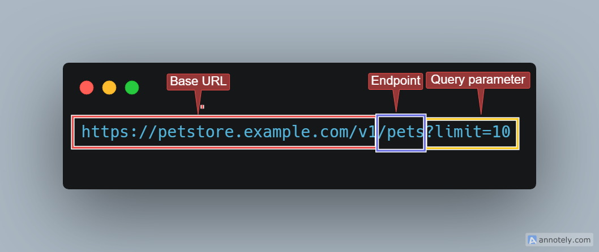
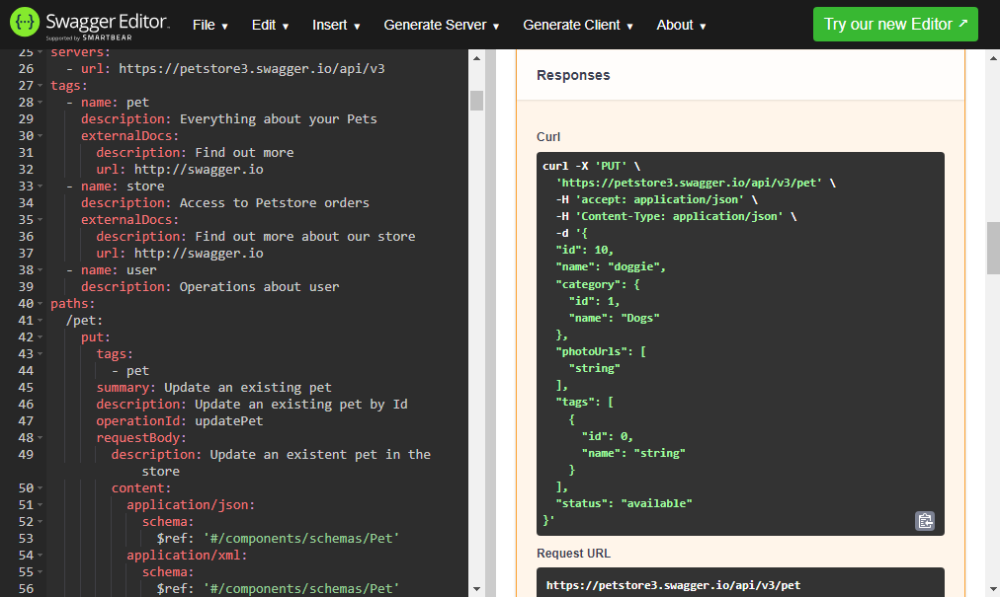

:::tip
In this module, we will learn about the **key components of an API (Application Programming Interface)** and how they function together to enable communication between different software systems.
By breaking down the core elements that make up an API, you’ll better understand how APIs facilitate seamless interaction between applications. This knowledge is fundamental to effectively using or developing APIs.
:::

## Getting Started

**First, you will start with the Top-Bottom approach**

Break away those tiny chunks, aka components, from a typical API sample and **explain** each of these components. Then, **put them back together** again to form the API.

**Sounds fun, right?**

**Let’s Roll**

## Sample API in a JSON format

> If you’ve been following the course in logical order (which we hope you have), then you’ll already be familiar with the **JSON format**. As always, you still use our **Sample Petstore API**, just like in the previous examples.

**Sample Petstore API**

```json showLineNumbers
{
  "openapi": "3.0.0",
  "info": {
    "title": "Petstore API",
    "description": "This is a sample server for a pet store.",
    "version": "1.0.0"
  },
  "servers": [
    {
      "url": "https://api.petstore.example.com/v1",
      "description": "Production server"
    }
  ],
  "components": {
    "securitySchemes": {
      "ApiKeyAuth": {
        "type": "apiKey",
        "in": "header",
        "name": "X-API-Key"
      }
    },
    "schemas": {
      "Pet": {
        "type": "object",
        "required": ["id", "name"],
        "properties": {
          "id": {
            "type": "integer",
            "format": "int64"
          },
          "name": {
            "type": "string"
          },
          "tag": {
            "type": "string"
          }
        }
      },
      "Error": {
        "type": "object",
        "required": ["code", "message"],
        "properties": {
          "code": {
            "type": "integer",
            "format": "int32"
          },
          "message": {
            "type": "string"
          }
        }
      }
    }
  },
  "security": [
    {
      "ApiKeyAuth": []
    }
  ],
  "paths": {
    "/pets": {
      "get": {
        "summary": "List all pets",
        "operationId": "listPets",
        "tags": ["pets"],
        "parameters": [
          {
            "name": "limit",
            "in": "query",
            "description": "How many items to return at one time (max 100)",
            "required": false,
            "schema": {
              "type": "integer",
              "format": "int32"
            }
          }
        ],
        "responses": {
          "200": {
            "description": "A paged array of pets",
            "content": {
              "application/json": {
                "schema": {
                  "type": "array",
                  "items": {
                    "$ref": "#/components/schemas/Pet"
                  }
                }
              }
            }
          },
          "default": {
            "description": "unexpected error",
            "content": {
              "application/json": {
                "schema": {
                  "$ref": "#/components/schemas/Error"
                }
              }
            }
          }
        }
      }
    },
    "/pets/{petId}": {
      "get": {
        "summary": "Info for a specific pet",
        "operationId": "showPetById",
        "tags": ["pets"],
        "parameters": [
          {
            "name": "petId",
            "in": "path",
            "required": true,
            "description": "The id of the pet to retrieve",
            "schema": {
              "type": "integer",
              "format": "int64"
            }
          }
        ],
        "responses": {
          "200": {
            "description": "Expected response to a valid request",
            "content": {
              "application/json": {
                "schema": {
                  "$ref": "#/components/schemas/Pet"
                }
              }
            }
          },
          "default": {
            "description": "unexpected error",
            "content": {
              "application/json": {
                "schema": {
                  "$ref": "#/components/schemas/Error"
                }
              }
            }
          }
        }
      }
    }
  },
  "headers": {
    "Accept": {
      "description": "Media type that is acceptable for the response",
      "schema": {
        "type": "string"
      },
      "example": "application/json"
    },
    "Content-Type": {
      "description": "The MIME type of the body of the request",
      "schema": {
        "type": "string"
      },
      "example": "application/json"
    }
  }
}
```

That’s a lot to take in; to be honest, the whole JSON format and all the tags make it look even more intimidating.

However, this is what a typical API sample would look like. To document an API, you **MUST** understand its **components**.

## Explaining Each of the API Components

Since you are using the top-down approach that I mentioned, you will start from the largest component to the smallest based on their **SCOPE AND PURPOSE NOT SIZE**

**The Components of an API**

1. Base URL
2. Authorization
3. Endpoints
4. Methods (HTTP Methods)
5. Request Body
6. Response
7. Request Headers
8. Response Header
9. Status codes

---

### Base URL

In order not to jump the boat by first explaining what a **Base URL** is, you need to understand why APIs have **URLs** and how they are structured.

We won't go into full details on **API URL structure**, but you will get a glimpse of how it works.

When you type in a URL, you are sending a request to the server bearing that address and a response will be sent back to you. The same happens with **API URLs**, but in this case, we are sending a request to the server to get an **API response**.

An **API URL** has three parts:

- **Base URL:** This is the initial part of the API URL that is used across all the API servers.

- The **endpoint:** The endpoint is the resource you want to access when you send the request (what you/the end-user is requesting)

- **Query parameter:** This is the last part of the URL, it contains a certain query to get specific information from the endpoint or resource you want to access. You can identify a query parameter with the initial question mark `?`


_This image shows the Base URL of our Sample Petstore API_

### Authorization

For security reasons, not everyone is allowed to access certain areas in an API especially ones that contain sensitive information. API Data is protected by adding an Authentication Layer which is normally called **Auth**. This Authentication Layer then **verifies** that the person trying to make a request has permission **using Authorization.**

Authentication and Authorization work hand in hand to ensure API security but play unique roles.
Let’s say you want to make an API request to get data on dogs available in our Petstore:

First, our Petstore API is protected since it contains sensitive information. You have to ask for the password access, that is Authentication. The authentication process here can be as simple as issuing you a unique username and password or using third-party tokens like Oauth, JWT etc.

Once you have gotten the password nothing happens except you key in the password into the system. Now Authorization steps in here to make sure that whatever credentials you have presented are approved.

When that is done, you are in.

### Types of Authentication

1. **OAuth:** OAuth involves using a third-party provider to grant access so that you don't have to share your credentials with the API provider. An example is using your Google account to sign up for different platforms. This is a typical example of an OAuth authentication and how it works.

2. **JWT Bearer:** This uses JSON Web Tokens (JWTs), where the server issues a signed JWT to the client, and the client includes this token in the Authorization header of requests; the server then verifies the token's signature to ensure its validity and authenticity.

3. **API key:** An API key is a unique identifier issued by the API providers themselves. When making a request to a server that uses an API key, you have to include the API key as a parameter in the request body.

4. **Basic Oauth:** This is a simple authentication method that allows you to send HTTP requests by providing a username and password in plain text.

**API Authentication in our Sample Petstore API**

```json showLineNumbers
{
  "components": {
    "securitySchemes": {
      "ApiKeyAuth": {
        "type": "apiKey",
        "in": "header",
        "name": "X-API-Key"
      }
    }
  },
  "security": [
    {
      "ApiKeyAuth": []
    }
  ]
}
```

Let’s understand the situation going on above. This is a snippet of how Authorization is used in an API document.

In the component `securitySchemes`, the type of authentication is defined as `apiKey`. This means that the API requires an API key for security.

Here’s a breakdown:

- `type`: `apiKey`: Specifies that the API uses an API key for authentication.

- `in`: `header`: Indicates that the API key should be included in the request header.

- `name`: `X-API-Key`: The name of the header where the API key should be provided.

In the `security` section, the `ApiKeyAuth` scheme is applied to the entire API or specific endpoints

### Endpoints

An API Endpoint is a URL. We have seen this in the diagram showing the parts of an API URL.
So the question is, what does an endpoint do? Well, we can say that it is the last destination of the API client on route to meet the API server.

An API endpoint is the location where the request by the API client is sent to retrieve the resource from the server. An application can have multiple endpoints. Each of these endpoints retrieves a specific resource. Since API endpoints lead to the specific location of the resource, we use them to test the API response.

**API Endpoints in our Sample Petstore API**

```{1-3} showLineNumbers
    /pets

    /pets/{petId}
```

### Methods (HTTP Methods)

HTTP methods refer to the kind of actions a Client wants to take on a resource. These actions can involve retrieving, deleting, or updating certain information.

**There are 5 HTTP Methods**

1. GET
2. POST
3. DELETE
4. PUT
5. PATCH

#### GET

The **GET** method is used to request data from a specified resource. From our Sample Petstore API, you can use the `GET` method to retrieve a list of pets or get details about a specific pet.

**Endpoint:** `/pets`
**Description:** Fetches a list of all pets in the store. You can optionally limit the number of pets returned using a query parameter.

**Example Request**

```{1-3} showLineNumbers
    GET https://api.petstore.example.com/v1/pets?limit=10
    X-API-Key: your-api-key-here
    Accept: application/json

```

**Example Response**

```json showLineNumbers
[
  {
    "id": 1,
    "name": "Doggo",
    "tag": "dog"
  },
  {
    "id": 2,
    "name": "Kitty",
    "tag": "cat"
  }
]
```

#### POST

The `POST` method is used to create a new resource in the specified resource collection. In the context of the Sample Petstore API, you can use the `POST` method to add a new pet to the store.

**Endpoint:** `/pets`
**Description:** Adds a new pet to the store.

**Example Request**

```json showLineNumbers
    POST https://api.petstore.example.com/v1/pets
    X-API-Key: your-api-key-here
    Content-Type: application/json

    {
      "id": 3,
      "name": "Bunny",
      "tag": "rabbit"
    }
```

**Example Response**

```json showLineNumbers
{
  "id": 3,
  "name": "Bunny",
  "tag": "rabbit"
}
```

#### PUT

The `PUT` method is used to update an existing resource or create a new resource if it does not already exist.

**Endpoint:** `/pets/{petId}`
**Description:** Updates the details of an existing pet by its ID.

**Example Request**

```{1-9} showLineNumbers
    PUT https://api.petstore.example.com/v1/pets/1
    X-API-Key: your-api-key-here
    Content-Type: application/json

    {
      "id": 1,
      "name": "Doggo Updated",
      "tag": "dog"
    }
```

**Example Response**

```json showLineNumbers
{
  "id": 1,
  "name": "Doggo Updated",
  "tag": "dog"
}
```

#### DELETE

The `DELETE` method is used to remove a resource from the server. From our Sample Petstore API, you can use the `DELETE` method to remove a specific pet from the store.

**Endpoint:** `/pets/{petId}`
**Description:** Deletes a pet from the store by its ID.

**Example Request**

```{1-2} showLineNumbers
    DELETE https://api.petstore.example.com/v1/pets/1
    X-API-Key: your-api-key-here
```

**Example Response**

```{1} showLineNumbers
    HTTP/1.1 204 No Content
```

### Request Body

The request body contains the data to be sent to the API. It has to be in a specified format such as JSON, YAML, XML, etc. The request body is usually specified under the `/path`

> We have covered API data formats in the previous module.

**Example of a Request Body from our Sample Petstore API**

Since we are using a `GET` method, the response body is not clearly defined. However, if we are using a `POST` request, the response body will be given as:

```json showLineNumbers
{
  "requestBody": {
    "description": "Pet object that needs to be added",
    "required": true,
    "content": {
      "application/json": {
        "schema": {
          "$ref": "#/components/schemas/Pet"
        }
      }
    }
  }
}
```

### Response

Response is the data returned by the API after processing a request. The Response is made up of three parts: The Response Header, the Response body and Status code. We will cover each of them individually.

**Response Body**
The Response body is the actual content returned after we send our request.

> Exercise: Run your request on Swagger UI and see the response body

**Sample of a Response Body**



_This image shows the response body returned after submitting a request on Swagger._

### Request Headers

A request header provides additional details on the format and type of the data in the request body. The request header holds important metadata about the request body such as the format request should be sent and authorization header.

**Types of Request Header**

Here are some types of request headers:

- **Content-Type:** This specifies the format of the data in the request body
- **Accept**: This specifies the type of content that can be accepted in a response.

**Example of Request Header from our Sample Petstore API**

```json showLineNumbers
    "headers": {
        "Accept": {
          "description": "Media type that is acceptable for the response",
          "schema": {
            "type": "string"
          },
          "example": "application/json"
        },
        "Content-Type": {
          "description": "The MIME type of the body of the request",
          "schema": {
            "type": "string"
          },
          "example": "application/json"
        }
      }
    }
```

### Response Header

Headers in general provide additional information about a component. In this case, a response header provides additional details on the format and type of the response.

**Types of Response Headers**

Here are some types of response headers:

- **Content-Type:** This specifies the format of the data in the response body
- **Cache-Control:** This specifies how the response should be cached (stored by the server in memory to reduce payload)
- **www-authenticate**: This is a type of authorization request header that indicates that authentication is required before the server can be accessed.

**Example of Response Header from our Sample Petstore API**

```json showLineNumbers
    "Content-Type": {
          "description": "The MIME type of the body of the request",
          "schema": {
            "type": "string"
          },
          "example": "application/json"
        }
      }
    }

```

### Status Codes

When you send a request, the API returns a response. Now the response may not always be what you expected.
Since an API always returns a response whether bad or good, Status codes are a necessity. Status codes are numbers that help you diagnose the situation of your responses.

Here is a well-explained list of status codes:

**1xx: Informational**

- **100 Continue**: The server has received the request headers, and the client should proceed to send the request body.
- **101 Switching Protocols**: The server is switching protocols as requested by the client.

**2xx: Success**

- **200 OK**: The request was successful, and the server returned the requested data.
- **201 Created**: The request was successful, and a new resource was created.
- **202 Accepted**: The request has been accepted for processing, but the processing is not yet complete.
- **204 No Content**: The request was successful, but there is no content to send in the response.

**3xx: Redirection**

- **301 Moved Permanently**: The resource has been moved to a new URL permanently.
- **302 Found**: The resource has been temporarily moved to a different URL.
- **303 See Other**: The response to the request can be found at another URL using a GET method.
- **304 Not Modified**: The resource has not been modified since the last request.

**4xx: Client Errors**

- **400 Bad Request**: The server could not understand the request due to invalid syntax.
- **401 Unauthorized**: Authentication is required and has failed or has not been provided.
- **403 Forbidden**: The server understands the request but refuses to authorize it.
- **404 Not Found**: The requested resource could not be found.
- **405 Method Not Allowed**: The request method is not allowed for the resource.
- **409 Conflict**: The request could not be completed due to a conflict with the current state of the resource.
- **413 Payload Too Large**: The request is larger than the server is willing or able to process.
- **415 Unsupported Media Type**: The media type of the request data is not supported by the server.

**5xx: Server Errors**

- **500 Internal Server Error**: The server encountered an unexpected condition that prevented it from fulfilling the request.
- **501 Not Implemented**: The server does not support the functionality required to fulfill the request.
- **502 Bad Gateway**: The server, while acting as a gateway or proxy, received an invalid response from the upstream server.
- **503 Service Unavailable**: The server is currently unable to handle the request due to temporary overloading or maintenance.
- **504 Gateway Timeout**: The server did not receive a timely response from the upstream server it needed to access to complete the request.
- **505 HTTP Version Not Supported**: The server does not support the HTTP protocol version that was used in the request.
