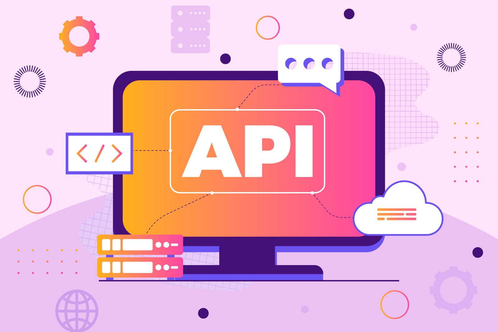
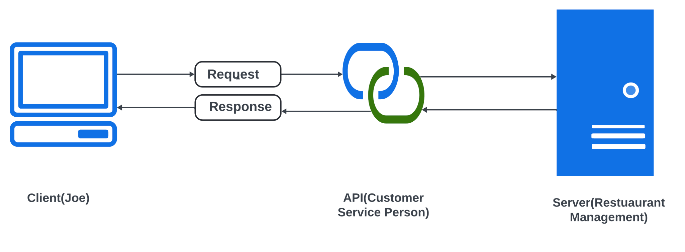
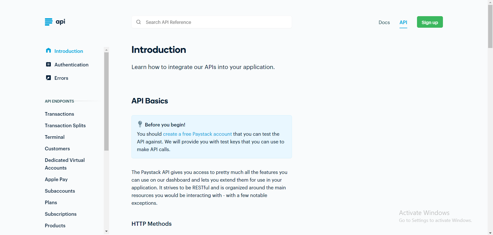
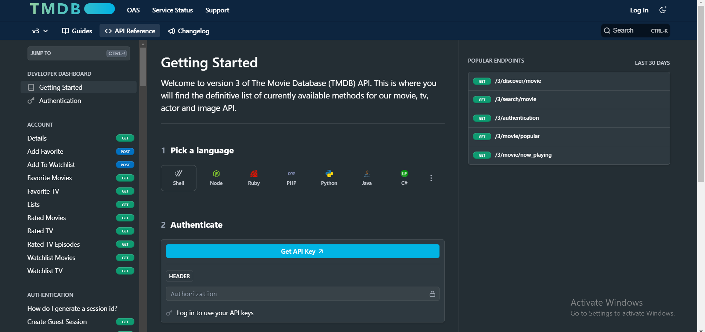
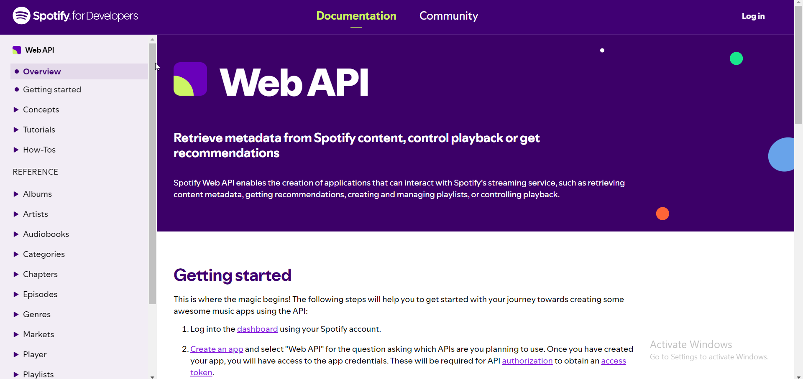

Building APIs that software products integrate is part of the software development process. A detailed and well-structured manual or guide on integrating the APIs is imperative. Thus, comprehensive API documentation is necessary for every organization and product that interacts with public or private APIs.

Imagine purchasing an LG smart TV without a manual or guide on how to set up and use the remote control. The experience would likely be frustrating and confusing, and the ability to use the TV would be limited. You may not understand how to navigate the settings or access its advanced functionalities, thus leading to a bad user experience.

This scenario illustrates the challenges developers encounter when APIs lack comprehensive documentation. Just as a manual enhances the usability of a television, API documentation is essential for enabling developers to leverage an API's full capabilities.

Many back-end developers struggle with writing detailed API documentation since not all developers are good writers. Whether you're new to API documentation as a technical writer or just trying to level up your skills, get your mind ready as I walk you through the basics of API documentation.

:::tip[In this section, you will learn]

- What is API Documentation
- Why Technical Writers Are Essential for Great API Documentation
- Types of API Documentation and,
- Examples of API Documentation
  :::

## What is API Documentation?


_**Fig.1**: What is API documentation_

API stands for application programming interface. API documentation is a form of [developer documentation](https://judy.hashnode.dev/what-is-developer-documentation-for-technical-writers#heading-types-of-developer-documentation). It is a detailed content, guide, manual, or reference to convey information to developers or the general public on integrating APIs into their applications.

This documentation contains endpoint descriptions, request and response examples, status codes, error messages, e.t.c

API documentation aims to ensure developers fully maximize an API's capabilities. The measure of maximizing an API capability is seen through the developer's ability to quickly understand the API and commence integration into their software applications or projects.

This reduces development time and enhances overall productivity. API documentation also serves as a reference manual for new and experienced API users, improving the developer experience and leading to higher adoption rates.

## Why Technical Writers are Essential for Great API Documentation

- Technical writers play a crucial role in delivering great API documentation. They combine their skills of writing clear and concise content with technical knowledge to structure and produce informative and easy-to-understand documentation.

- Technical writers leverage their communication skills with the project team to describe a broader sense of how developers could use the APIs.

- Not all developers are great writers. They do not consider the background and experience of their users. Technical writers, as opposed to developers, prioritize the user's needs.

- They consider their audience by asking questions like "Who is the target audience?" and "What information do users need to get started?" This focus aids in writing the documentation to meet the users' demands.

- Technical writers bridge the gap by explaining the technical jargon associated with APIs for easy comprehension. They can describe APIs in a way that resonates with the target audience, contributing to an API's success and adoption rate in the developer community.

- By taking over the documentation role, technical writers let developers do what they do best: writing code and improving the API.

## How Do APIs Work?

API acts as a middleman that allows different software applications to communicate and exchange data. This communication occurs in a request-response cycle. The players during this cycle are the client and server. The client could be a browser, mobile application, or web application, while the server is the backend where the business and application logic is written.

Where does the API come in? The API mediates between client and server by sending requests and returning responses.


_**Fig.2**: How API works_

Using the analogy of a Dinner Reservation in a restaurant, **Joe (Client)** has a dinner reservation for three and would like to change it to six. Joe calls **customer service (API)** to place a request. The customer service person forwards the request to the **restaurant management (Server).** Restaurant Management provides food and services to the clients.

That is how an API works: In this case, the customer service acts like an API, an intermediary that processes requests and returns responses without ever having to see or deal with much of the complexity at the back end.

In software development, the client makes API calls to the server using a communication protocol such as the Hypertext Transfer Protocol (HTTP). The API helps retrieve the information requested by the client from the server, which is like a resource center that stores different types of information.

## Types of APIs

API types can be categorized by access and function.

**By Access**

- **Public APIs:** Public APIs are open to anybody and are a great way to access data or functionality from another service. A few public APIs, such as the OpenWeatherMap API, have free and paid versions.
- **Partner APIs:** Partner APIs are exposed or made available to parties or organizations based on the relationship between the organization providing the API. These APIs are secured to ensure that only authorized partners can access them.
- **Internal APIs:** Internal APIs, also known as private APIs, are only used by a company's internal developers. They expose functionality within a company's system or application and are not meant for public use. For example, a company building a learning management system might have a private API that handles login functionality and another that handles private messaging on the system.

**By Function**

- **Hardware APIs:** Software applications can communicate with devices like sensors, cameras, or graphics cards through hardware APIs. These APIs provide low-level interactions between software applications and hardware, enabling data control and exchange.They also facilitate the development of software that can run on various hardware configurations. This is particularly important in environments with various devices, such as smartphones, tablets, and more. For example, a camera API would allow an application to take pictures.

- **Software Library APIs:** Software library APIs provide a standardized interface for developers to interact with and utilize a software library's functionality from their code. These APIs specify a set of methods, functions, classes, and attributes the library makes available for external use. The implementation details of a library are hidden. A developer can use previously existing code and functionality by importing these libraries without writing everything from scratch. For example, the Math Module library API in Python. This API consists of mathematical functions that perform basic operations such as addition (+), subtraction (-), multiplication (\*), and division(/). To use it, import the `math` module. Here's a simple example:

```python {1-5} showLineNumbers
    import math
    x = math.sqrt(64)

    print(x)  # output 8.0
```

- **Web APIs**: Web APIs are designed for use over the web. They use communication protocols like HTTP to allow applications to communicate and transmit data over a network. The most common type of API is web APIs, which power various applications such as social media apps, e-commerce websites, and mobile apps. They represent and transmit data in multiple formats, including JSON (JavaScript Object Notation) and XML (Extensible Markup Language).

import Quiz from '@site/src/components/Quiz';

<Quiz
  questions={[
    {
      text: 'An API documentation must contain the following:',
      options: [
        { value: '1', label: 'Endpoint expiration, call and response, and error messages' },
        { value: '2', label: 'Endpoint descriptions, request and response examples, and error messages' },
        { value: '3', label: 'Endpoint updates, status codes, and error messages.' }
      ],
      correct: '2'
    },
    {
      text: 'What communication protocol is used to make API calls to the server?',
      options: [
        { value: '1', label: 'Simple Mail Transfer Protocol' },
        { value: '2', label: 'File Transfer Protocol' },
        { value: '3', label: 'Hypertext Transfer Protocol (HTTP)' }
      ],
      correct: '3'
    }
  ]}
/>


## Examples of API Documentation

### 1. [**Pay Stack API Documentation**](https://paystack.com/docs/api/)


_**Fig.3**: Paystack API_

Paystack provides a comprehensive API reference to assist developers and other users in integrating the API into their applications. This documentation incorporates the essential information every API documentation should have, well structured and easy to navigate. For example,

- A clear introduction
- Authentication and error handling guidelines
- Detailed endpoint descriptions and,
- Request and response examples

In addition to the API reference, Paystack provides in-depth developer documentation that guides developers in integrating and utilizing the API. Developers and businesses can use the Paystack API to simplify online payment processing in Nigeria and across Africa.

It offers a solid framework for handling transactions, customers, subscriptions, and more, making the payment process more efficient and secure for businesses. To access the API, you need to create a free [Paystack account](https://dashboard.paystack.com/#/signup) to get test keys against which you can test your API.

### 2. [**Paypal API Documentation**](https://developer.paypal.com/api/rest/)


_**Fig.4**: PayPal API_

The Paypal API documentation provides a well-structured interface for easy navigation. Its search function makes it easy for developers to find specific pages. The documentation is straightforward and easy to understand, so new users can easily find what they are looking for without feeling overwhelmed.

The documentation is divided into various sections, offering detailed resources to help users get started with the API, including:

- Getting started guide
- Authentication instructions
- Postman guide
- References
- API description and more.

An outstanding feature of the PayPal API documentation is the release notes section, which keeps developers updated on new changes and recent updates.

The PayPal REST API enables developers to securely accept online payments, send money, manage transactions, and more. This API can be integrated into applications, allowing them to accept international payments easily.

Getting started requires creating a PayPal developer account to generate API credentials and obtain an access token to authenticate API calls. The PayPal API is free; you only need to create your account on [the PayPal signup page](https://www.paypal.com/signin/client?flow=provisionUser&country.x=US&locale.x=en_US) to access the developer's dashboard.

You will need a [PayPal Business account](https://www.paypal.com/business/open-business-account) to go live with integrations and test integrations outside the US.

### 3. [**The Movie Database API Documentation (TMDB)**](https://developer.themoviedb.org/reference/intro/getting-started)


_**Fig.5**: The Movie Database API_

The TDMB API documentation caters to both new and experienced developers. The user interface is easy to navigate with well structured content. It provides comprehensive information on authentication methods, endpoint descriptions, request and response examples, an interactive interface for testing API, versioning, and guides for getting started.

The TMDB API enables users to search for and access details about movies and TV shows, including cast, crew, ratings, release dates, and trailers. Additionally, users can modify their lists by adding or removing items and providing ratings for movies and TV shows.

This API is free. All you need to do is [sign up](https://www.themoviedb.org/signup) for an API key or token on the TMDB platform.

### 4. [**Spotify Web API Documentation**](https://developer.spotify.com/documentation/web-api)


_**Fig.6**: Spotify API_

The Spotify API documentation stands out with its interactive interface for testing the API. It is well-organized into sections for easy navigation and offers detailed and logically presented information.

Key features include:

- Detailed endpoint descriptions
- Example request and response
- Step-by-step tutorials for common use cases, e.g, creating a web app to display profile data
- Getting Started guide and more.

The Spotify Web API enables developers to create applications that interact with Spotify's streaming service. It excels at retrieving content metadata, playback control, user library management, generating recommendations, and securing access to user data. These tools help build music-related applications that enhance user experience.

The API is free to use. To get started, see the [getting started guide](https://developer.spotify.com/documentation/web-api) in the API documentation.

:::tip[Assignment]

1. Choose two of the API documentation examples mentioned in the content (PayStack, PayPal, The Movie Database, or Spotify).
2. Conduct a detailed comparison of these two API documentations, focusing on:

- Structure and organization

- Ease of navigation

- Clarity of information

- Completeness of content (e.g., authentication, endpoints, examples)

- Any unique features or standout elements

3. Write a 300-500 word analysis highlighting the strengths and potential areas for improvement in each.

Lastly, after review, publish on your blog and tag @Technicalwrit6 on Twitter and LinkedIn, stating that this is your introduction to API Documentation Course.
:::
