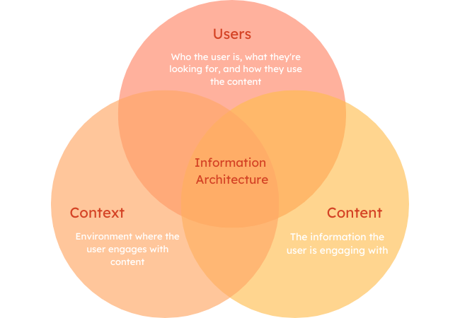
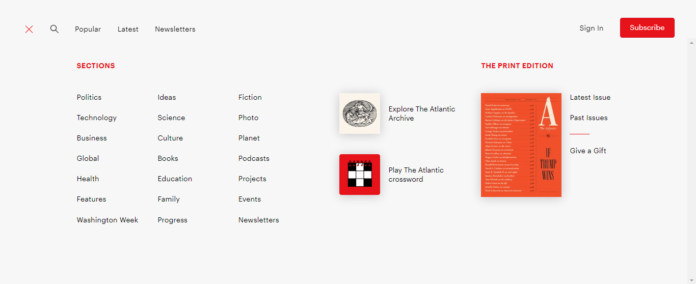
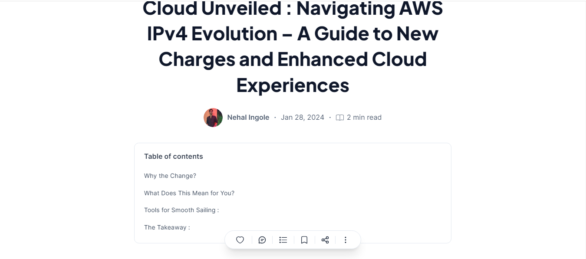

:::tip
Peter Morville says - “Findability precedes usability; you can’t use what you can’t find. which makes information architecture vital when curating technical documentation that we want readers to find useful.
:::

:::note

In this Module, you will learn:

- All about information architecture
- Its importance to technical writers and readers
- Information architecture taxonomy and its importance
- How to create efficient technical documentation
- Key principles guiding information architecture

:::

## What is information architecture

Information Architecture, or IA, streamlines complex information by organizing it logically, sequentially, and concisely. It is the way we structure and label content in an effective and user-friendly manner.

Information architecture helps improve the usability and accessibility of digital products and services.

It is how the content of applications, websites, and information systems are organized and labeled for easy access and usage, saving users considerable time.

A good information architecture anticipates user needs and ensures a logical flow of information is followed through intelligent grouping and intuitive navigation medium.

_**Figure 1**: Key element of information architecture_

Good information architecture equates to a good user experience. For that reason, information architecture focuses on where users can find information easily and connect three important elements for effective delivery, namely:

- **User**: The first step to useful technical documentation is understanding the users’ needs, goals, and mental models when seeking new information. This is to ensure information structure aligns with users’ ways of thinking and searching.

- **Content**: This is the actual information behind the Information architecture. It consists of content structure, its organization, labeling, images and media used.

- **Context**: This focuses on the environment and circumstances where users access information so the technical article is readily usable in different situations.

## Importance of information architecture in technical documentation

Information architecture plays a crucial role in technical documentation in multiple ways. It helps technical writers create clear and concise documents, promoting usability and strengthening comprehension of complex technical content for users.

Below are the key importance of information architecture in technical documentation.

- **Sound user experience**: Information architecture ensures technical documentation is organized logically and intuitively, allowing users to access the required information quickly and efficiently. It adds structure and intuitive navigation to simplify complex information for users. This leads to greater user satisfaction and reduces frustration.

- **Consistency**: Technical documentation with good information architecture appears more consistent in terms of vocabulary, text formatting, and content style, which improves the document’s professionalism and reduces confusion among readers, particularly when dealing with complex technical concepts.

- **Ease of search**: Technical documentation frequently uses jargon and complicated vocabulary. By implementing a well-structured, Information hierarchy and incorporating effective metadata and glossary, a well-executed search engine helps readers locate relevant information.

- **Accessibility**: Strong information architecture makes technical documentation accessible to everyone, including users with assistive technology. As a writer, anticipate readers with diverse needs. IA empowers you to build content by factoring in these user classes, and creating clear, labeled, and well-structured documentation for everyone.

- **Promotes collaboration**: Information architecture streamlines collaboration between technical writers and stakeholders, guaranteeing a unified approach to crafting user-centric documentation. This shared framework fosters cooperation and aligns contributions with the core objective.

- **Encourages content reusability**: Information architecture promotes the development of reusable and modular information pieces. This method simplifies the documentation process, reduces duplication, and guarantees uniformity among various forms of documentation.

- **Strengthens understanding**: Information architecture ensures information is arranged logically and sequentially, facilitating readers’ comprehension of the connections and context between various documentation sections. This facilitates understanding and makes it easier for readers to absorb technical ideas easily.

## Information architecture taxonomy

In Information architecture, taxonomy is crucial in organizing and labeling content using a hierarchical structure.

It is how information is segmented and labeled within a shared information environment. It helps organize topics, subtopics, and related content within manuals and guides.

_**Figure 2**: Taxonomy in use in The Atlantic website_

The picture above is a taxonomy being used in [The Atlantic](https://www.theatlantic.com/world/) to specify broad categories like “Technology”, “Business”, “Global”, “Health”. It makes information easily discoverable and also strengthens SEO

Think of Information architecture as a clothing store; the taxonomy is the dedicated space where each shopper will find men's, ladies', children’s, and babies' shoes and accessories.

Then the clothing store will have other subcategories where dresses, pants, jackets, and shirts are found within the ladies' clothing section.

_**Figure 3**: Information architecture and taxonomy working together to deliver content efficiently in an e-commerce platform_

The picture above is a prime example of [Jumia](https://www.jumia.com.ng/), an e-commerce platform that makes efficient use of taxonomy.

The items listed on the far left are termed as information architecture, On clicking any of the listed items and in this case “Fashion”, we could see the subcategories like “WOMEN’S FASHION”, “MEN’S FASHION”, “KID’S FASHION”, “WATCHES”, “SUNGLASSES”, and “TOP BRAND”.

Another example is the navigation menu on your favorite website. Each menu option serves as the taxonomy, and it could consist of a sub-menu where users can find similar information that relates to each other.

Now that you understand what information architecture taxonomy is all about, let's find out how to curate ours about information architecture. 

The key steps for drafting an information architecture taxonomy are explained below.

1. **Identify the audience**: Understanding your audience is crucial for creating an effective taxonomy with their needs and expectations. Here are key aspects to consider when you want to identify your audience.

2. **Roles and responsibilities**: You need to determine who would be using your technical documentation, the likely skill they intend on learning, their job role, and what task they will perform using the documentation. Answering these questions helps you understand their objectives and workflows, which aids you with structuring information accordingly.

3. **Technical expertise**: Your users' technical knowledge and experience will influence the terminology, complexity, and depth of information you include.

4. **Information needed**: You need to know the specific information your users need. Then, you categorize these needs into topics, subtopics, related topics, and references to other articles that could fill a gap, especially for those needing a certain skill before they can grasp the content of the technical documentation you are offering them.

:::tip
Ensure you prioritize the most essential information based on your users' needs.
:::

5. **Context of use**: Consider how users access the documentation, e.g., online, printed, or mobile. Also, consider In what environment it would be used.

6. **Expectations and user preference**: Find out how users typically search for information which could range from keywords, exploration e.t.c. Find out what level of detail is expected and formatting preferences if possible.

7. **Method of gathering information**: You should review existing documentation feedback to know what users like and want as an improvement. You can also conduct surveys and web analytics and collaborate with subject matter experts to gather insights and validate assumptions.

8. **Map out user journey**: Do a walk-through on the steps users will take when interacting with the documentation.

:::tip
Note down likely pain points users are trying to find answers to and the key decision point where they will find a solution to their probing question in your documentation.
:::

9. **Create content categories**: To do this, you have to define the content goal. Do you want them to learn to perform a task successfully, find specific information, or troubleshoot?

_**Figure 4**: Table of content showing content category for easy navigation_

The above image is an example of a technical documentation on [Hashnode](https://hashnode.com/). The content goal has been defined, which is an article on “Navigating AWS IPV4”.

If we then pay a closer look at the content category for this article, we can see how intentional the writer is with regards to enlightening his readers and what he wants them to learn when they read his article.

Once you have an answer to the question above, you can do the following.

- **Analyze existing content**: Pay close attention to all content items, topics, format, and organization. Identify gaps and overlaps to know if any topic is missing or needs better coverage based on user feedback. Also, identify any redundant content.

- **Card sorting**: Understand how content items are grouped to understand categorization preferences.

- **Identify key concepts and relationships**: Break down subject matter into topics and subtopics, forming a hierarchical Tree structure. Consider how each topic relates to the other such as the parent-child relationship, part of the topic, or sequential process.

- **Choose category labels**: Ensure chosen terms are clear and concise. Avoid technical jargon that might be unfamiliar at all costs.

:::tip
Also, ensure you use consistent terminology throughout the taxonomy to avoid confusion on the user's part.
:::

10. **Create content hierarchy**: To do this, you should think like a user and structure content as a user would think when searching for information. Place essential topics at the top of the hierarchy and group related content together for easy access. Also, consider future changes and growth when curating your content hierarchy.

11. **Define layout and navigation**: Consider information density and visual hierarchy in your documentation. Use headings, spacings, and visual elements to guide users and signal importance. You should balance text with visuals (gifs, sketches, videos, images) to break up content and aid understanding. A user-friendly navigation system should also be considered.

:::tip
You should consider the following navigation methods.
:::

- **Global navigation**: Consistent top-level access to primary categories should be present throughout the documentation.

##### Example:

[Kubernetes](https://kubernetes.io/docs/home/) documentation makes good use of this by using a clear and consistent global navigation bar at the top of every page and it remains visible wherever you are on the page.

It also provides easy access to key sections of the documentation like “Getting started”, “Concept”, “Task”. And lastly, the user’s location within the documentation at any particular time is highlighted for easy tracking.

_**Figure 5**: Global navigation system of kubernetes documentation website_

- **Local navigation**: Provide navigation for lengthy contents such as breadcrumbs, "jump to" links, and table of contents.

- **Search functionality**: Implement a robust search feature for quick content delivery.

_**Figure 6**: Local navigation and search functionality on kubernetes documentation website_

While still on the Kubernetes documentation example used in Global navigation, from the image above, we can see those highlighted texts in blue. They serve as a :jump to” links mentioned in the examples above.

They are useful when a user needs to read more about that particular piece of information. It also provides a well-integrated search feature on the page to enable users to discover relevant documentation based on keywords.

:::tip
Following these steps diligently will let you create a taxonomy that organizes information logically and resonates with your target audience.
:::

#### Benefits of Taxonomy for your Technical Documentation

- **Improved user experience**: A well-defined taxonomy leads to a positive user experience by making it easier for users to find what they need and complete their tasks.

- **Documentation consistency**: Using a consistent taxonomy ensures that similar information is always grouped, making it easier for users to understand the overall structure of the information.

- **Efficient content management**: A well-defined taxonomy makes organizing and managing large amounts of content easier.

- **Search result**: By aligning the taxonomy with search keywords, you can ensure that users get more relevant results when they search for specific information.

## How to create an information architecture for your technical documentation

- **User research**: Understanding the problem space is the first step in creating a good information architecture.

It isn't uncommon to see an article on a particular topic, but that article doesn't explain succinctly what the users need. Research would let you know what knowledge gap you are trying to fill, how to approach the topic based on the reviews you've seen on existing content, how readers think when exploring digital repositories, and what type of reader is your target audience.

:::tip
User research lets you define your audience and goals.
:::

- **Content inventory**: This is where you collate all existing articles on a particular topic and then audit each one in order to gather insights on how useful and accurate the information is to readers, what is missing, and what needs to be added to make for a sound article that would help users find what they are looking for easily.

- **Information grouping and classification**: After you must have settled for an area in which you want to focus your article on, the next logical step is to note down what each section of the article contains and what are their sub-sections. This would create a logical hierarchy and a seamless way for users to understand your thought process, the information you wish to impact on them, and how each sub-section relates to the main section.
  
- **Proper labeling and taxonomy**: Create a clear and concise label that leaves no room for ambiguity.
  Users should understand what your label means at the first read without having to guess second what that section is all about.

- **Define hierarchy and navigation structure**: Rank information based on its importance to the readers. A user who intends to read an article on a particular topic has a particular pain point they are trying to solve.

  Your duty is to instinctively know what that information is and place it where it would serve them best. You should also consider the best navigation structure for your content that would serve users well without any frustration, whether it is a table of content or another navigation style.

- **Gather feedback and iterate**: Be sure to test your article /documentation with real users as well as your fellow technical writers to gather insight on what you have done right and what needs to be adjusted, and iterate based on feedback obtained.

## Information architecture principles to consider when drafting your technical documentation

Crafting effective information architecture is not a game of chance. It's a disciplined process guided by established principles and methodologies.

It starts with a deep understanding of the application, content, and organizational goals, followed by the consistent application of established principles throughout the process.

- **The principle of objects**: Content should be viewed as a living and breathing document with unique characteristics, lifecycle, behaviors, and attributes. Content is more than just static text as each piece of information evolves from creation to publication, revision, and eventual removal when it has served its use.

- **The principle of choices**: Overloading users with too much information leads to a bad user experience. Humans have a short attention span; therefore, create pages that offer meaningful choices to users without them having to stress their brain.

- **The principle of disclosure**: Present users with just enough information they can understand at a stretch and let them decide if they want to explore further. So technical articles often have an external link for readers who want to dive deeper. In summary, embrace a progressive disclosure approach by gradually unveiling more information as users dictate interest.

- **The principle of exemplars**: Some sections are not self-explanatory for an average user when writing technical documents. Provide examples as an image to exemplify the content as images are more visually appealing than text, and your readers will grasp the initial text easily afterwards.

- **The principle of first doors**: Not all users will get to read your article right from the start as some of your audience could come in contact with it through optimized keyword search. Therefore, provide a welcoming experience at every point with relevant information and clear navigation that would make the site accessible to them.

- **The principle of multiple classification**: Accommodate diverse User preferences by providing multiple ways for users to search the content on your site. factoring keyword searches, top-level menus, and intuitive browsing mechanisms are some ways of doing this, but some users might wish to browse or move through the hierarchy, so make sure your information architecture meets their needs.

- **The principle of focused navigation** It emphasizes the importance of clarity and consistency in navigation design. This would help readers understand the content structure and easily locate the needed information.

- **The principle of growth**: Embrace flexibility and anticipate future expansion as there is every likelihood that the content you start with will evolve over time. Ensure it remains organized and scalable.

### Exercise

Choose a complex technical concept of your choice, research extensively and write on it. Ensure you apply all you've learnt about information architecture and adhere to all the tips and measures from this documentation.

After review, tag @TechnicalWriti6 on Twitter to the link to your article.

## Answer the following questions

import Quiz from '@site/src/components/Quiz';

<Quiz
  questions={[
    {
      text: 'Why is taxonomy important when building your information architecture for technical documentation?',
      options: [
        { value: '1', label: 'It enhances user understanding by grouping related topics together' },
        { value: '2', label: 'It eliminates the need for usability testing' },
        { value: '3', label: 'It forces users to follow a specific path in the documentation ' },
        { value: '4', label: 'It ensures all topic are covered' }
      ],
      correct: '1'
    },
    {
      text: 'What is the primary goal of information architecture in technical documentation?',
      options: [
        { value: '1', label: "To reduce maintenance cost" },
        { value: '2', label: 'To make technical documentation visually appealing' },
        { value: '3', label: 'To replace the need for clear writing' },
        { value: '4', label: 'To improve findability for users' }
      ],
      correct: '4'
    }
  ]}
/>

