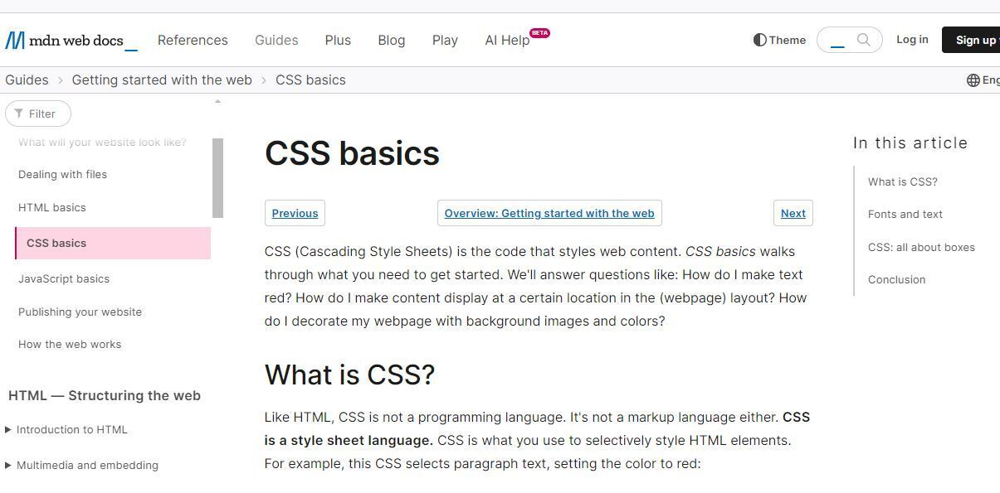
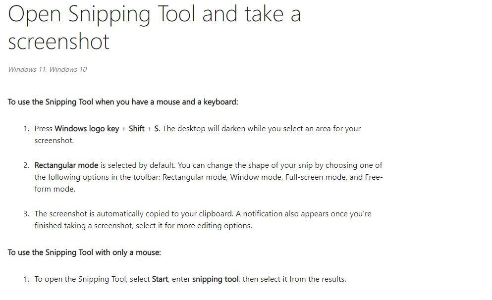

Writing for different audiences is necessary for every writer; it involves tailoring your content to ensure it is accessible, engaging, and comprehensible to the readers.

:::tip
In this module, you will learn how to:

- Identify your audience
- Tailor your writing to your audience
- Use plain language
- Avoid technical jargon
- Write for different levels of expertise
:::

## Identifying your Audiences

Identifying your audiences is the bedrock of successful communication; it involves knowing who your readers are and what they expect and tailoring your content to meet their needs.

But who exactly is your audience?

### Who is an Audience?

An audience refers to the people who will engage with your content. They could be customers, users, or anyone interested in what you have to say. Identifying your audience helps you create content that resonates with them, whether it is a product manual, a blog post, or a technical report.

It is critical to paint a clear picture of who you are writing for since your readers are different; they may differ in education, interest, technicality, and many others. This is where audience analysis comes in.

### What is Audience Analysis?

Audience analysis is the process of understanding, researching, and interpreting information about your intended audience. This examination helps you tailor your writing to your audience's needs, expectations, and characteristics. It is a vital starting point for creating any technical document, whether an instructional manual for a device intended for a general audience or a tutorial for software developers.

In a nutshell, audience analysis is a way for writers to get to know their audience.

### Importance of Audience Analysis

Audience analysis is vital in technical writing; it makes it easier for you to write to reach your document's goal.

_Some reasons why audience analysis is essential._

#### 1. Knowledge Transfer

The goal of technical writing is to help professionals convey knowledge to end-users. Technical writers can ensure that knowledge is efficiently delivered by streamlining the transfer of information through recognizing the audience's level of expertise with the subject area.

#### 2. Effective Communication

Knowing your audience helps you to convey your message in a manner that is clear, concise, and relevant to them since communication is a two-way process.

#### 3. Empathy and Connection

Audience analysis enhances empathy; this entails putting them in your shoes, it goes beyond passing information, it creates a shared experience.

#### 4. Increased Engagement

An audience's attention is captured, and engagement is sustained when your content speaks directly to their problems or is in line with their specific needs or interests.

#### 5. Preventing Miscommunication

Inability to understand your audience can lead to miscommunication and confusion; you can avoid using inappropriate language and assumptions by analyzing your audience.

#### 6. Building Credibility

Showing that you understand your audience builds credibility. Your audience is more likely to trust your information if they perceive you as knowledgeable about their needs and concerns.

### Steps in Audience Analysis

There are several steps to conduct audience analysis; they include:

#### 1. Define the Purpose of Communication:

Clarifying the purpose of your communication is an important step in audience analysis; it serves as a guiding principle regarding the content, tone, and delivery. You need to know what you aim to achieve with your communication. Is your writing meant to inform, instruct, or persuade?

For example, are you writing a technical manual to guide users or writing content to promote a product? Defining your purpose lays the foundation for delivering an effective message that resonates with your audience.

#### 2. Gather Information about your Audience

Information gathering helps you find as much information as possible about the audience you are writing for. The more information you gather, the easier it will be for your writing.

_Some of the questions you will ask to get the needed information are:_

- Who is the audience?

- What do they need to know?

- When will they be reading?

- Why will they be reading?

- How will they be reading?

You can use tools like _Typeform_ and _Survey Monkey_ to gather information about your audience.

#### 3. Define Your Type of Audience

After gathering information about your audience, define your audience type based on the information. Your audience could be a professional, an expert, or a novice. Defining your audience will help you determine the existing knowledge of your readers.

**Types of Audiences**

Audiences can broadly be categorized into two main groups;

- _Technical Audiences_
- _Non-Technical Audiences_

**1. Technical Audience**

These individuals have a specialized understanding of a technical subject. They possess expertise gained through training, education, or professional experience in a particular field. They include software developers, IT professionals, data analysts, and other specialized professionals. Communicating with technical audiences involves using precise technical languages and providing detailed documentation.

Technical audiences can be grouped into:

- _Low-level Technical Audiences_
- _High-level Technical Audiences_

**Low-level Technical Audiences**

This refers to individuals who have a foundational understanding of technical concepts within a specific domain. They may be novice programmers, developers, entry-level technicians, or those with limited knowledge in a technical field. Examples of writing include an introduction to html and CSS for beginners in web development.

:::tip
Writing for these audiences is foundational, which requires simpler and more detailed explanations to enable them to build their skills.
:::

Below is an article written for low-level technical audiences.

_**Figure 1**: A Documentation written for low-level Technical Audiences_

**High-level Technical Audiences**

This refers to individuals with an advanced understanding of complex technical terms. They are often experts in their fields with extensive education, experience, and training. They include Subject matter experts, Senior engineers and Architects, advanced researchers, scientists, and cyber security specialists.

:::tip
Writing for these audiences requires a deep understanding of their specialized knowledge and ability to convey complex information clearly and precisely
:::

Examples of writing meant for this audience are advanced programming and code documentation and complex algorithm documentation in machine learning. Below is an article written for high-level technical Audiences.

_**Figure 2**: An Article written for high-level Technical Audiences_

**2. Non-Technical Audiences**

This refers to individuals who lack specialized knowledge in a particular technical field; they include individuals from various backgrounds and professions who utilize a product or service but may not have a deep understanding of the underlying technology. Non-technical audiences include end users of software applications, educators, stakeholders, investors, and the general public.

Examples of writing for this audience include 'How to make a screenshot,' 'How to use Google Meet,' and 'How to save and transfer files'. Below is an example of an article written for the non-technical audience.

_**Figure 3**: An Article written for non-technical Audiences_

:::tip
Defining your audience into the categories above will help you create appropriate documentation and communicate successfully.
:::

#### 4. Develop a Persona for your Audience

Personas are fictional characters used to represent members of a specific audience. Creating a persona can help you focus your writing on what's important to your readers; your writing can be specific and interesting. With the information you have gathered, you could create a fictional character with a name, gender, age, job title, location, etc.

#### 5. Tailor your Writing to your Persona

Now that you have a persona in mind, you need to tailor your writing to suit your persona. They should dictate the language you use, the level of technicality, and what to include or exclude. Writing to meet your audience's needs requires selflessness; you must learn to create explanations that satisfy your audience's curiosity rather than your own.

## Tailoring your Writing to your Audience

Once you have identified your audience, the next step is tailoring your writing to meet their needs and expectations. This involves adapting your language, tone, format, style, and content to effectively communicate with your specific audience.

### 1. Use Examples and Analogies

Examples are one of the ways to connect with your audiences, especially when writing instructions. Make your writing relatable by using real-world examples and analogies. This will help your users grab complex content faster.

### 2. Add Information Readers Need to Understand your Documentation

Review to see whether important information is missing. For example, a how to guide on a software application for beginners; definition of key terms, step by step approach to ensure that your readers are not misled. You can also add glossaries and references for further reading.

### 3. Select Appropriate Language

Use appropriate language for your audience, avoid technical jargon and idioms, and use acronyms properly. For example, acronyms like HTTP, API, and HTML should be written fully to help readers understand.

### 4. Provide Context and Background

Present enough background information to help your audience understand the context of the message; don't assume that your readers have the same knowledge as you on a particular topic. For example, an extensive introduction on a particular product which may include its history.

### 5. Select the Right Style and Tone

Your document should be simple and easily understood, minimizing complex terms. Your writing should be formal, with clear headings and subheadings.

## Using Plain Language

### What is Plain Language?

The Plain Writing Act of 2010 defines plain language as clear, concise, well-organized writing that follows other best practices appropriate to the subject or field and intended audience. Plain language is also known as plain writing or plain english.

### Importance of Using Plain Language

Using plain language in technical writing is important to you and your readers. Some of its importance are:

**1. Clarity:** Using plain language helps you reduce the risk of misunderstanding, errors, and miscommunication.

**2. Accessibility:** Plain language makes your information accessible to a wider audience, including those with various levels of education, language competence, and topic experience.

**3. Increased Engagement:** Using plain language helps your readers engage and act on the information delivered, whether commercial materials or instructional content.

**4. Build Trust and Credibility:** Using plain language helps build trust and credibility with your readers. When you write honestly and helpfully, you demonstrate concern for your readers and their needs. It shows that you are informed about your topic and can effectively explain it.

**5. User-friendly Documentation:** Using plain language improves the comprehension of manuals, guidelines, and instructions; this is essential for products and software where ease of use is a priority.

### Plain writing Tips and Techniques

To write in plain language, there are some tips you need to apply to assist you in simplifying your writing; here are some of them:

**1. Write in Active Voice**

Use active voice makes it easy for your readers to understand the intended meaning of a sentence. It is a valuable tip for achieving plain language in your writing.

:::tip[Example]

**Active voice:** The team lead gave feedback.

**Passive voice:** The feedback was given by the team lead.

**Active voice:** The Scrum master implemented changes to the Kanban board.

**Passive voice:** The changes to the Kanban board were implemented by the Scrum master.
:::

**2. Use Short Sentences as much as Possible**

Clear writing should have an average of 15 to 20 words, though every sentence must not be the same length. Stick one main idea in a sentence.

**3. Use Consistent Words**

Avoid using different words with the same meaning to your readers. Use coherent words.

> Example:
>
> If you use the word "For example" to refer to an illustration, don't change it to "for instance" in another line of your documentation.

**4. Use Everyday Words**

Use commonly used words that will not confuse your readers or give them a hard time grabbing the content of your documentation. If you must use technical terms, explain them first in your sentence.

> For example, use "end" instead of "terminate", and “use”

**5. Write Directly to your Readers**

Use the second person point of view to refer to your readers, such as "you", and "your", remember you are writing for your readers, not yourself.

> Example:
>
> In this documentation, you will learn how to create a hamburger using HTML and CSS.

## Avoiding Technical Jargon

### What is Technical Jargon?

Technical jargon is a specialized term or expression specific to a particular profession, such as abbreviations and acronyms unfamiliar to most people. It helps group members recognize other members and communicate reliably without explaining basic terms. There are several jargon meant for occupational group use. Fields like engineering, medicine, and science all have their jargon.

For example, words like application programming interface(API), A/B Testing, and Augmented Reality(AR) are all jargon in information technology. Jargon can be used if your audience is professionals in a field to establish authority, But if your audience is the general public or a layman, then you have to translate all your jargon into a common expression

### How to Avoid Jargon

Technical jargon can pose challenges to those who are not familiar with the specialized terminology, below are tips to avoid it.

**1. Know your Audience**

Understand the knowledge and expertise of your audience. It is okay to use jargon if your audience understands it, but if you speak to people outside your field or newbies, use generally understood terms or define words.

**2. Get a second person to read your work**

It is best to have someone else proofread it and give you feedback. They can see which words are clear or confusing. Try to pick someone who is your target audience, ask them if there are words they don't understand, and ask if the words compel them to take action on its purposes or if they are bored.

**3. Read your Writing out Loud**

Read your writing out loud to notice words and phrases that may sound complex; this is because spoken words reveal complexities that may go unnoticed when reading silently.

It probably reads that way if it sounds awkward or unnatural. Rewrite it until it sounds like plain speech. Eliminating confusing jargon and paying attention to your audience's words will help you communicate more effectively and win their trust.

## Writing for Different Levels of Expertise

When you write content for different levels of expertise, you need to adjust it to suit individuals with varying levels of knowledge and experience on the topic. This approach acknowledges that your audience may consist of beginners, intermediate users, advanced practitioners, and experts.

The ultimate purpose is to ensure that everyone within your target audience can access and benefit from your content. Here's a breakdown of what writing for different levels of expertise entails.

**1. Novice/Beginners**

These individuals are new to a particular subject or technology. They have limited or no prior experience in the area being discussed. They seek to understand the basics, grasp fundamental concepts, and learn to navigate or use a specific technology. They require clear explanations and step-by-step instructions.

For example, a "Docker for beginners" documentation should contain a strong introduction, installation, basic commands, and how to use them.

**2. The Advanced Beginners**

These individuals have moved past the novice stage and acquired some basic knowledge in a particular technology or field. Advanced beginners understand the subject matter and have gained the confidence to explore more advanced tasks.

For example, documentation on "Advanced React" should include real-world examples to enable them to gain hands-on experience.

**3. The Competent**

These individuals possess a solid understanding of the technology or field. They are capable of handling more complex tasks independently. They have gained experience and are used to advanced terminology.

Writing for the competent should be specific since they use the technical documentation for reference rather than relying on it for learning. The content should reflect their proficiency level.

**4. Proficient**

These individuals have mastered a particular technology or field. They comprehensively understand the subject matter and possess advanced skills to navigate complex concepts easily. Writing for proficient users entails advanced insights, detailed technical analysis, and in-depth discussions of advanced cases.

**5. The Experts**

These include users at the peak of knowledge and expertise in a particular field or technology. They have a deep understanding and extensive experience of complex concepts.

Technical documentation for experts should be advanced and sophisticated. It should reflect their advanced knowledge and expectations. It should provide insights beyond the basics and cater to professionals seeking the latest and most advanced information.

:::tip[Assignment]
Complete the following exercises before leaving this module.

Write an article on how to use VScode for a low-level technical audience

Follow the instructions below;

- Conduct an audience analysis to understand the needs and preferences of your readers.
- Create a table of contents that outlines the structure of your article.
- Your article should be at least 500 words long.
- Minimize the use of AI, and use simple language that is easy to understand.
- Include relevant images to support your content.
- Ensure that your article has no spelling, grammar, or punctuation errors.

Lastly, tag @Technicalwrit6 on Twitter and LinkedIn, stating that this is your exercise for module 2.
:::

import Quiz from "@site/src/components/Quiz";

<Quiz
  questions={[
    {
      text: "One of these is not a step in audience analysis",
      options: [
        { value: "1", label: "Information Gathering" },
        { value: "2", label: "Tailoring your writing to your persona" },
        { value: "3", label: "Trust and Credibility" },
      ],
      correct: "3",
    },
    {
      text: "What is the Bedrock of a successful communication in technical writing?",
      options: [
        { value: "1", label: "Audience Identification" },
        { value: "2", label: "Audience Analysis" },
        { value: "3", label: "Audience Characteristics" },
      ],
      correct: "2",
    },
  ]}
/>
