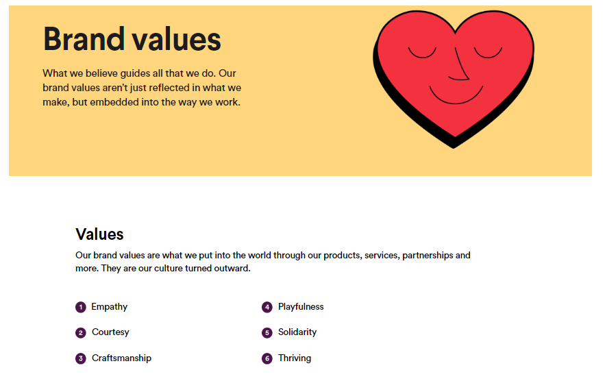
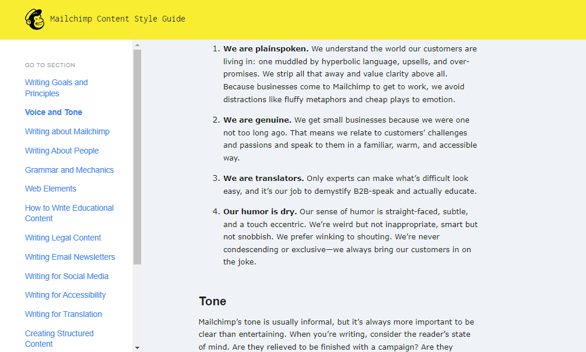
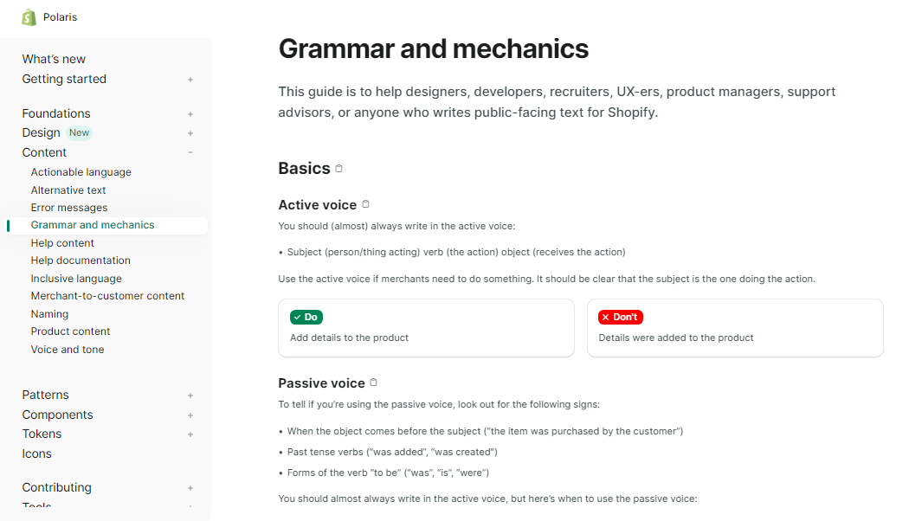
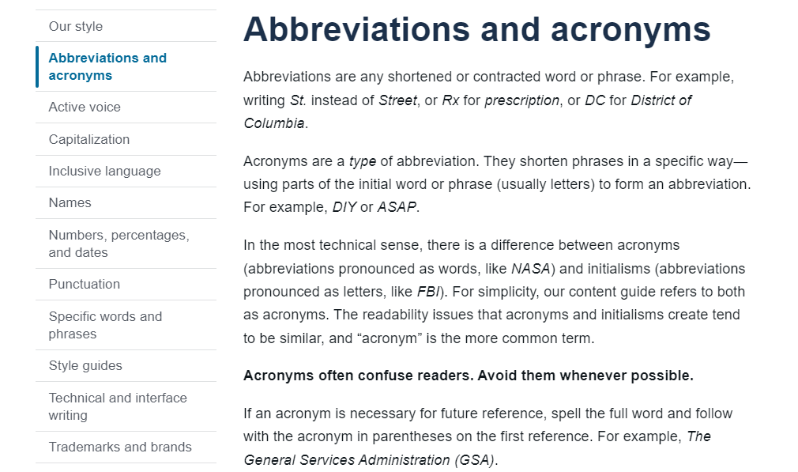
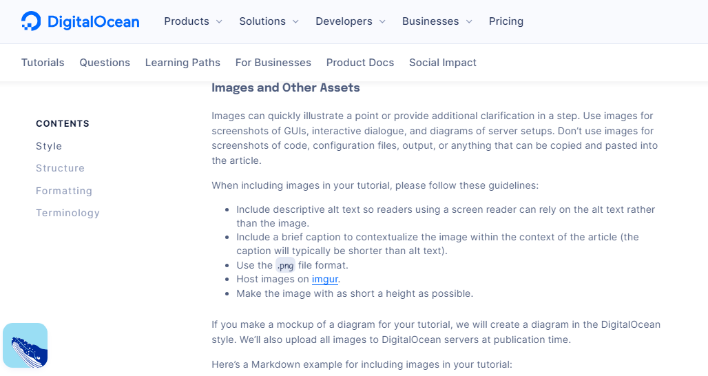

:::tip In this Module, you will learn:

- What a writing style guide is
- How to create a writing style guide
- Why it is important to have a writing style guide
- Popular style guides and how to pick one for your project

:::

## What is a writing style guide?

A writing style guide, also known as a manual of style, is a document containing standards (rules) for writing and formatting documents. Its purpose is to assist writers in maintaining consistency in their writing style and ensuring that the documentation is clear and easy to understand.
Whether crafting a blog article or collaborating with a documentation team, a style guide is crucial in maintaining a consistent brand voice and tone. Without this consistency in your writing style, your readers may struggle to grasp your intended message.

For instance, observe how the Google Developers documentation style guide utilizes its guide to maintain consistency.
In the following example, you'll see clear guidelines on formatting lists. They not only provide clear guidelines but also examples on representing various list types in their documentation and how to introduce them.

### Google Developers Documentation Style Guide
**Introductory sentences for lists**

- Introduce a list with the appropriate context. In most cases, precede a list with an introductory sentence.

- The sentence can end with a colon or a period; usually a colon if it immediately precedes the list, usually a period if there's more material (such as a note paragraph) between the introduction and the list.

- If the list doesn't need any additional context other than the heading that immediately precedes the list, it's OK to not introduce a list with an introductory sentence.

- Introduce a list with a complete sentence, not a partial one that's completed by the list items. You can also use the following as a noun phrase (see following in the word list).

**Recommended**

Use the **Submit** button for any of the following purposes:

- To submit the form.
- To indicate that you're done.
- To allow the next person to enter their data.

To learn more about Google Developers Documentation style guide, visit [Google Developers Documentation Style Guide](https://developers.google.com/style/lists).

## How to Create a Writing Style Guide

If you're unable to find a pre-existing guide that aligns with your company's style and brand, consider creating an in-house guide.
This allows you to tailor the guide to effectively communicate your company's values, establish a desired voice and tone, and ensure the use of appropriate grammar and punctuation.

In this section, you'll delve into these essential aspects and more for creating a comprehensive style guide.

The following are important attributes that must be contained in your style guide:

### 1. Establishing the Company's Brand

The first step in crafting an effective guide is aligning the writer's mindset with the company's identity, values, and objectives.
This step is crucial as it enables the writer to comprehend the company's brand and how to effectively communicate it to the reader.
Addressing a company's brand entails emphasizing its values, mission, and vision. Placing your company's brand identity at the forefront of your style guide is essential. It serves as a constant reminder for the writer.

An excellent illustration of effective brand communication is demonstrated by [Slack](https://brand.slackhq.com/brand-values). They clearly outline their identity, values and all they represent.

_**Figure 2.** Slack's Brand Identity_

A solo writer may find this step less critical, but it becomes crucial when collaborating with a team of writers. Ensuring everyone is aligned with the company's brand fosters consistency in communication.

### 2. Use an Existing Publishing Guide

While creating your own guide, Keep in mind that guides have a rich history. There's no need to reinvent the wheel. Consider using an existing publishing guide as a starting point for crafting your own.
Choose a guide that aligns with your specific requirements. 

For instance:

- For technical documentation, opt for a [APA Style guide](https://apastyle.apa.org/). 
- For an academic document, consider using the [MLA handbook](https://style.mla.org/).

### 3. Voice and Tone

Understanding voice and tone is crucial, yet it can be misunderstood by many writers. Voice represents the personality of your writing, while tone sets the mood.

:::tip Voice and Tone tip

  If you're composing a blog post about a new product, aim for a friendly voice and an excited tone.

  :::

For companies with diverse social media outlets for customer communication, maintaining a consistent voice and tone is essential. Consistency plays a key role in building trust with customers.

When determining the tone and voice for your company, consider asking a few key questions:

  - Are you aiming to be formal or informal?
  - Do you prefer a friendly or professional tone?
  - Is your style more serious or humorous?

Answering these questions will guide you in making decisions about the tone and voice that best represent your company.
An exemplary case of a company effectively communicating its voice and tone is [Mailchimp](https://styleguide.mailchimp.com/voice-and-tone/). They provide extensive details on how their company engages with customers.

_**Figure 2.** Mailchimp's voice and tone_

### 4. Grammar and Punctuation

Having defined the voice and tone, it's now time to delve into the finer details of your guide. 

Consistent rules regarding grammar and punctuation are essential, to avoid a confusing documentation.
When determining the grammar and punctuation rules for your company, consider asking a few questions:

  - Do you want to use the Oxford comma?
  - Are you inclined towards the serial comma?
  - Is the em dash or en dash your preference?

Given the multitude of standards in this area, refer to [Shopify's style guide](https://polaris.shopify.com/content/grammar-and-mechanics) for a comprehensive example. They provide clear explanations with numerous examples to illustrate their grammar and punctuation rules.

_**Figure 3.** Shopify's grammar and punctuation_

Ensure you provide examples for every point you make in your guide. This practice aids your writers in understanding the intended message and application of the guidelines.
  

### 5. Formatting

While many guides combine the formatting and grammar sections, I've chosen to separate them due to their distinct nature. Formatting is about how you present content to your readers. Consider questions like whether to use bold or italics, headings or subheadings, lists or tables, etc.

When establishing formatting rules for your company, ask the following key questions to guide your decisions:

  - Do you prefer using bold or italics for emphasis?
  - What is your approach to using headings or subheadings?
  - Are lists or tables the preferred format?

Asking these questions will aid in defining the formatting style for your documentation.

A notable example of effective documentation formatting can be found in the [Google Developer Documentation Style Guide](https://developers.google.com/style/text-formatting). This guide provides comprehensive rules for formatting, covering areas such as headings, titles, numbers, lists, tables, and more.
  Asking these questions will aid in defining the formatting style for your documentation.

_**Figure 4.** Google Developer Documentation Style Guide formatting section_

### 6. Terminology and abbreviations

To create the terminology and abbreviations section, compile a comprehensive list of all terms and abbreviations specific to your company. This list guides writers in using the correct terms and abbreviations in documentation.

When deciding on terminology and abbreviations, consider these key questions:

  - Should two-letter initialisms have periods?
  - How do you introduce abbreviations?
  - What significance do italics and abbreviations hold for your company?

Answering these questions aids in making informed decisions for your style guide.

A commendable example of incorporating terminology and abbreviations into documentation can be found in [The 18F Content Guide](https://guides.18f.gov/content-guide/our-style/abbreviations-and-acronyms/). This guide helps you know when to use abbreviations, how to introduce them, and more.

  

  _**Figure 5**. 18F's Content Guide terminology and abbreviations section_

### 7. Images and diagrams

Many companies have a separate design style guide for visuals and media content. It's crucial to include essential information on how writers source images.
Certain questions need answers if writers are responsible for creating images or diagrams. For instance:

  - What is the preferred image format?
  - Are there specific preferred dimensions?
  - Should all images include a brand logo?

Addressing these questions will provide clarity for writers creating visual content.

Providing guidance on producing images aligned with the company's goals is essential for writers. [DigitalOcean](https://www.digitalocean.com/community/tutorials/digitalocean-s-technical-writing-guidelines#images-and-other-assets) serves as an excellent example, effectively communicating necessary information about incorporating images into content.

  

  _**Figure 6**. DigitalOcean's image and assets style guide section_

:::note

Striking the right balance is crucial for a style guide. It shouldn't be excessively long, diverting writers' focus and resulting in subpar documentation. It should not also be too short, leading to random filling of missing parts and conflicts in style. An optimal style guide typically spans three to five pages, offering sufficient, focused information for writers.
:::

import Quiz from '@site/src/components/Quiz';

<Quiz
  questions={[
    {
      text: 'All of the following are components of a style guide EXCEPT:',
      options: [
        { value: '1', label: 'Voice and tone' },
        { value: '2', label: 'Grammar and punctuation' },
        { value: '3', label: 'Typography' },
        { value: '4', label: 'Formatting guidelines' }
      ],
      correct: '3'
    },
    {
      text: 'What does the section on "Voice and Tone" in a style guide address?',
      options: [
        { value: '1', label: "Rules for grammar and punctuation" },
        { value: '2', label: 'Choosing the right image format' },
        { value: '3', label: 'Establishing the companys brand' },
        { value: '4', label: 'Defining the personality and mood of writing'}
      ],
      correct: '3'
    }
  ]}
/>

### Use a Template

If you prefer not to start from scratch or are on a tight deadline to create a company style guide, consider using a template.
Templates serve as boilerplate where you can input your company's information, including vision, mission, and all the necessary sections discussed above.
If you prefer not to start from scratch or are on a tight deadline to create a company style guide, consider using a template. Templates serve as boilerplate guides where you can input your company's information, including vision, mission, and all the necessary sections discussed above.

Google search gives several style guide templates, but [Writers.com](https://writer.com/downloads/style-guide-template.txt) offers a particularly neat and recommended template.
Downloading this template provides a solid starting point for creating your style guide.
Always keep in mind that consistency is the key to a good style guide. Adhere consistently to the standards and rules you adopt.

## Why It's Important to Have a Writing Style Guide

The primary aim of a style guide is to enhance communication between the writer and the reader. With a well-defined style guide, writers can uphold consistency throughout their documents, thereby reducing the cognitive load on readers.

Below are few reasons why adopting a style guide is beneficial:

**1. Establishing a Distinct Brand Representation** 

Take popular blogs like MDN or DigitalOcean for example. You can quickly identify an article as theirs simply by observing the writing style. This is made possible by their adherence to a style guide, ensuring a consistent brand voice and tone.

:::tip MDN Writing Style Guide Sample

**How to add images and media**

To add an image to a document, add your image file to the document's folder, and then reference the image from within the document's index.md file using Markdown image syntax or the equivalent HTML </img> element.

To learn more about MDN writing style guide, visit [MDN Web Docs](https://developer.mozilla.org/en-US/docs/MDN/Writing_guidelines).
:::

This is crucial as it contributes to building trust with your readers. When readers trust you, they are more inclined to return for more content. This is particularly significant for technical writers aiming to establish a brand or companies seeking to cultivate a community around their product.

**2. Minimize Readers' Cognitive Load** 

A style guide enables you to sustain consistency in your writing style, simplifying the understanding of your documentation for readers. Without a style guide, readers would need to invest more time deciphering your documentation due to inconsistency of content.

The longer it takes readers to understand your documentation, the more likely they are to leave. This is detrimental for your blog or company, as it translates to potential loss of subscribers or customers.

**3. Simplified editing process**

A style guide streamlines the editing of your documentation for your editors. With a clear set of guidelines, they know exactly what to look for during the editing process. Without a style guide, editors would spend more time figuring out what needs editing.

When editors struggle to find useful information in your documentation, they're more likely to make mistakes. These errors can have significant repercussions on the credibility of your documentation.

**4. Single Source of Truth (SSOT)**

It serves as a centralized point of reference containing all information related to your documentation. SSOT encompasses grammar and punctuation rules, formatting guidelines, terminologies, abbreviations, as well as visual elements like images and diagrams.
The lack of a style guide means that your writers will invest more time figuring out how to format their documents. This is due to the absence of a trustworthy source containing all the necessary information for editing their documentation.

## Popular Style Guides and How to Choose for Your Project

While you can create your own style guide (which we'll discuss later), there are advantages to relying on an existing guide.
Using an existing style guide saves time since you don't have to create one from scratch. You can simply choose one that fits your needs and start using it immediately.
Style guides are categorized based on the type of content they address. Examples include style guides for technical documentation, academic writing, open source documentation, and more.

Here are details about some of the most popular style guides, helping you in selecting the one suitable for your project.

### 1. Publishing Style Guides

Publishing style guides are employed by publishers to uphold consistency in their publications. They encompass aspects such as grammar, punctuation, formatting, and more. Here are some of the most popular publishing style guides:

- [The Chicago Manual of Style](https://www.chicagomanualofstyle.org/home.html)
- [The Associated Press Stylebook](https://www.apstylebook.com/)
- [The MLA Style Manual](https://style.mla.org/)
- [The APA Style Guide](https://apastyle.apa.org/)

### 2. Technical Writing Style Guides

Technical writing style guides assist technical writers in ensuring consistency in their documentation. They address aspects like punctuation, terminology, abbreviations, images, diagrams, and more. Here are some of the most popular technical writing style guides:

- [Microsoft Manual of Style](https://docs.microsoft.com/en-us/style-guide/welcome/)
- [Google Developer Documentation Style Guide](https://developers.google.com/style)
- [Apple Style Guide](https://help.apple.com/asg/)
- [IBM Style Guide](https://www.ibm.com/ibm/styleguide/)

### 3. Content Style Guides

Many blogs and companies utilize concise style guides to uphold consistency in their content. These guides cover various aspects to ensure uniformity. Here are some of the most popular content style guides:

- [MDN Web Docs](https://developer.mozilla.org/en-US/docs/MDN/Writing_guidelines/Writing_style_guide)
- [DigitalOcean](https://www.digitalocean.com/community/tutorials/digitalocean-s-technical-writing-guidelines)
- [The Red Hat Style Guide](https://styleguide.redhat.com/)
- [The Mailchimp Content Style Guide](https://styleguide.mailchimp.com/)

### 4. Open Source Style Guide

Guides governing technical content in open source projects are crucial for maintaining consistency. Here are some of the most popular open source style guides:

- [Gnome Documentation Style Guide](https://developer.gnome.org/documentation/guidelines/devel-docs.html)
- [Open SUSE Documentation Style Guide](https://documentation.suse.com/style/current/single-html/docu_styleguide/)

### 5. Government and Academic style guides

Government agencies and academic institutions rely on style guides to uphold consistency in their content. Here are some of the most popular government and academic style guides:

- [Princeton University Style Guide](https://communications.princeton.edu/guides-tools/princeton-editorial-style-guide/)
- [Gov.uk Style Guide](https://www.gov.uk/guidance/style-guide)
- [Plainlanguage.gov](https://www.plainlanguage.gov/guidelines/)

:::tip

When using a style guide, make sure to follow it persistently throughout your documentation. Don't mix and match different style guides because the representation of information can confuse your readers.

:::

:::tip Exercise

**Complete the following exercises before proceeding to the next module.**

Imagine you've been tasked with creating a comprehensive writing style guide for a tech company. Use the information provided in this section to complete the following tasks:

1. **Style elements identification**: Identify and list at least **five key style elements** that should be addressed in the writing style guide. These may include grammar rules, punctuation conventions, formatting guidelines, tone considerations, and use of industry-specific terminology.

2. **Explanation and examples**: For each style element identified, provide a clear and concise explanation of why it's important and how it should be applied. Include at least two examples demonstrating both correct and incorrect usage.

3. **Visual Design**: Design a visually appealing layout for the style guide document. Include appropriate headings, subheadings, bullet points, and other formatting elements to improve readability and usability.

:::

Adhere to all the tips and measures emphasized in this documentation. After review, tag @TechnicalWriti6 on Twitter to the link to your style guide.